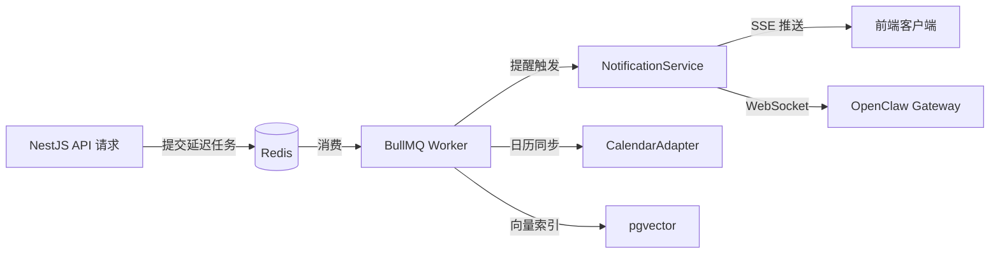

# AI 驱动的科研工作台：完整技术架构方案

> **文档类型**: 技术架构设计文档  
> **目标读者**: 科研工作者、独立开发者、开源贡献者  
> **核心项目**: OpenClaw 开源 AI 助手二次开发  
> **调研范围**: 前端、后端、数据库、AI 服务层、消息桥接、部署运维、安全隐私  
> **调研深度**: 12 个技术维度 × 300+ 独立搜索 × 30+ 开源项目  
> **生成日期**: 2026-04-20

---

# 1. 项目概述与核心目标
---

### 3.1 技术选型

#### 3.1.1 NestJS：与 OpenClaw 同生态的企业级框架

后端框架的选型需要同时考虑运行时性能、开发效率与生态系统兼容性三个维度。科研工作台的核心诉求是与 OpenClaw Gateway（Node.js/TypeScript 实现）无缝集成，因此 Node.js 生态成为首选范围。在 Node.js 框架中，NestJS 凭借模块化架构（Modular Architecture）和依赖注入（Dependency Injection, DI）容器，已成为企业级应用的事实标准 [^1^]。与 Express.js 的自由组合模式不同，NestJS 强制采用基于模块的代码组织方式，每个功能域（Domain）拥有独立的 Controller、Service 和 Entity，天然适配科研工作台多模块（日程、任务、笔记、文献、番茄钟）的业务结构。

NestJS 的技术特性与科研工作台需求存在多处精确匹配。其内置 `@nestjs/websockets` 模块支持 Socket.IO 和原生 WebSocket 双模式 [^18^]，可直接对接 OpenClaw Gateway 的 JSON-RPC 2.0 消息协议 [^15^]；`@nestjs/swagger` 模块通过装饰器自动生成 OpenAPI 文档，CLI 插件可减少最多 50% 的手动装饰器代码 [^2^]；`@nestjs/bullmq` 官方包将队列深度集成到依赖注入系统中，实现类型安全的任务生产者与处理器 [^21^]。此外，NestJS 支持在 Express 与 Fastify 两个底层 HTTP 引擎间切换，当性能成为瓶颈时可无感迁移到 Fastify 适配器。

| 维度 | NestJS (Node.js/TS) | FastAPI (Python) | Gin (Go) |
|------|:---:|:---:|:---:|
| 与 OpenClaw 同生态集成 | ★★★★★ | ★★★ 需跨语言适配 | ★★ 需跨语言适配 |
| 开发效率与类型安全 | ★★★★★ 全栈 TypeScript | ★★★★★ Pydantic | ★★★★ Go 类型系统 |
| 运行时性能 (req/s) | ★★★★ Express/Fastify 双引擎 | ★★★★ 30,000–40,000 [^4^] | ★★★★★ 极轻量 |
| WebSocket/实时通信 | ★★★★★ 内置 Gateway 模块 [^18^] | ★★★★ 原生支持 | ★★★★ 需第三方库 |
| 任务队列生态 | ★★★★★ BullMQ 官方集成 [^21^] | ★★★★ Celery | ★★★ Asynq |
| API 文档自动生成 | ★★★★★ Swagger 装饰器 [^2^] | ★★★★★ 原生 OpenAPI | ★★★ 需手动配置 |
| 企业级模块化 | ★★★★★ IoC + 切面编程 | ★★★★ 依赖注入 | ★★★ 中间件模式 |

框架对比矩阵清晰地反映了选型逻辑：NestJS 在"与 OpenClaw 同生态集成"和"企业级模块化"两个对科研工作台至关重要的维度上具有不可替代的优势。虽然 Gin 在纯性能指标上领先，FastAPI 在 AI/ML 场景下社区活跃，但科研工作台并非高并发 API 网关或模型推理服务，其瓶颈在于 I/O 密集型操作（数据库查询、WebSocket 消息转发、PDF 解析），而非计算密集型任务。NestJS 基于 Node.js 事件循环的异步非阻塞 I/O 模型在此场景下完全够用。

#### 3.1.2 为什么不用 Python/Go：全栈 TypeScript 的类型共享优势

弃用 Python（FastAPI/Django）和 Go（Gin/Echo）的核心原因并非框架本身存在缺陷，而是全栈 TypeScript 带来的工程效率增益。科研工作台的前后端边界高度模糊：前端需要理解 DTO（Data Transfer Object）结构以渲染表单，后端需要复用前端类型定义以校验请求体，AI 层（OpenClaw）使用 TypeScript 定义消息协议。全栈统一 TypeScript 意味着 DTO、接口类型、验证规则可以在 `packages/shared-types` 等 monorepo 子包中单点定义，前后端与 OpenClaw 客户端共享同一套类型系统，消除因类型漂移导致的运行时错误。

Python 的 FastAPI 虽然在异步性能和自动文档生成上表现优异（30,000–40,000 req/s [^4^]），但引入 Python 运行时意味着科研工作台需要维护两套类型定义（Pydantic 模型与 TypeScript 接口），跨语言边界时的序列化/反序列化成为持续的维护负担。Go 的编译速度和二进制部署优势更适用于微服务网关场景，而非需要频繁迭代功能模块的科研工具。NestJS 的另一直接优势在于 npm 生态的复用：OpenClaw 官方 Node.js 客户端 `openclaw-node` [^17^] 可直接嵌入后端服务，无需额外的语言桥接进程。

### 3.2 API 设计与实时通信

#### 3.2.1 RESTful API 处理 CRUD 操作

科研工作台的后端 API 采用 RESTful 风格，资源导向的 URL 设计（`/api/v1/calendars`、`/api/v1/tasks`、`/api/v1/notes`）配合标准 HTTP 动词和状态码。REST 协议在 API 生态中仍占 83% 的主流份额 [^6^]，其无状态特性和缓存友好性非常适合日程、任务、笔记等实体的 CRUD 场景。`@nestjs/swagger` 模块在编译期扫描控制器装饰器，自动生成 Swagger UI 交互式文档 [^7^]，前端开发者可在浏览器中直接测试 API 而无需额外的接口文档维护成本。

API 版本通过 URL 前缀（`/api/v1/`）控制，为未来可能的不兼容升级预留迁移窗口。分页采用 Cursor-based 策略替代传统的 Offset 分页，以应对笔记和番茄钟记录等高频率写入场景下的数据一致性问题。请求体校验使用 NestJS 内置的 `ValidationPipe`，结合 `class-validator` 装饰器实现声明式参数校验。

#### 3.2.2 WebSocket 处理 AI 流式响应与 OpenClaw 对接

WebSocket 在科研工作台中承担两条独立的实时通道。第一条通道是前端与 NestJS 后端之间的实时通知通道，基于 `@nestjs/websockets` 和 Socket.IO 实现 [^18^]，支持房间（Room）级别的消息扇出，用于番茄钟状态广播和日程提醒推送。`@WebSocketGateway` 装饰器提供生命周期钩子（`OnGatewayInit`、`OnGatewayConnection`、`OnGatewayDisconnect`），配合 JWT  handshake 认证，确保每条连接都绑定到已认证用户 [^19^]。

第二条通道更为关键：NestJS 后端作为 OpenClaw Gateway 的控制平面客户端（Control-plane Client），通过 WebSocket 连接到 `ws://127.0.0.1:18789/ws`，使用 JSON-RPC 2.0 消息格式进行通信 [^15^]。OpenClaw Gateway 作为长期运行的 Node.js 守护进程，是系统的中央消息路由枢纽 [^13^][^14^]。NestJS 后端通过 `openclaw-node` 库 [^17^] 封装这一连接，将 Gateway 的流式响应（`agent.thinking`、`agent.response` 事件）转换为前端可消费的 SSE/WebSocket 消息。双通道架构实现了 AI 层与工作台层的完全解耦：OpenClaw 的版本更新仅需 `npm update`，不影响工作台业务逻辑。

#### 3.2.3 SSE 处理服务端推送

对于单向服务端推送场景——日程提醒触发、番茄钟计时状态同步、AI 任务完成通知——Server-Sent Events (SSE) 是比 WebSocket 更轻量的选择。SSE 基于 HTTP 协议，天然支持自动重连和事件 ID 追踪，无需客户端维护复杂的重连逻辑。NestJS 通过 `@Sse()` 装饰器可直接将 Observable 流转换为 SSE 响应，实现日程提醒的精确时间推送和番茄钟倒计时状态的服务端驱动更新。

### 3.3 核心服务模块

后端采用单体优先（Monolith-first）的模块化架构，各功能域以 NestJS Module 为单位组织，通过 Shared Module 暴露通用能力（PrismaService、OpenClawClient、RedisCache）。这种设计保留了后续微服务拆分的清晰边界，同时避免了分布式系统带来的运维复杂度 [^34^]。

| 服务模块 | 核心职责 | 关键技术/依赖 | 对外接口 |
|----------|---------|--------------|---------|
| 认证服务 (AuthService) | JWT 签发/校验、OAuth2 社交登录、Refresh Token 轮换 | `@nestjs/passport`、`passport-jwt`、`passport-github2`、`passport-google-oauth20`、bcrypt | REST `/api/v1/auth/*` |
| 日程服务 (CalendarService) | 事件 CRUD、iCal 导入导出、CalDAV 同步、RRULE 展开 | `ical.js`、`rrule`、Google Calendar API、Microsoft Graph | REST + SSE |
| 任务服务 (TaskService) | 任务 CRUD、子任务树、标签系统、优先级排序、预估番茄数关联 | Prisma 嵌套写入、闭包表模型 | REST `/api/v1/tasks/*` |
| 笔记服务 (NoteService) | Markdown 存储、Git 版本控制、YAML Frontmatter 元数据索引 | `gray-matter`、`simple-git`、pgvector (全文+语义检索) | REST + WebSocket |
| 番茄钟服务 (PomodoroService) | 专注计时记录、中断原因追踪、高效时段分析 API | 内存状态机 + PostgreSQL 持久化、date-fns 统计 | REST + SSE |
| 文件处理服务 (FileService) | PDF 文本提取、缩略图生成、上传/下载管理 | `unpdf`/PyMuPDF、`sharp`、S3 Presigned URL | REST `/api/v1/files/*` |

上表展示了六大核心服务模块的职责边界与技术选型。每个模块均遵循 NestJS 的三层架构模式：Controller 处理 HTTP/WebSocket 协议细节，Service 封装业务逻辑，Repository（通过 Prisma Client）隔离数据访问。这种一致性降低了新模块的开发成本——开发者只需遵循既定的模块模板即可快速添加新功能域。

#### 3.3.1 认证服务

认证服务采用 JWT（JSON Web Token）+ OAuth2 的组合方案 [^8^][^9^]。JWT 作为无状态的 Access Token，包含用户 ID、角色和过期时间，由 `@nestjs/jwt` 模块签发和校验。`@nestjs/passport` 集成 `passport-jwt` 策略实现即插即用的路由守卫 [^10^]。Refresh Token 采用轮转（Rotation）策略：每次 Access Token 刷新时同步生成新的 Refresh Token，旧 Token 立即失效并记入 Redis 黑名单，在兼顾无状态架构优势的同时降低 Token 泄露风险。

OAuth2 集成支持 Google 和 GitHub 两种社交登录方式，通过 `passport-google-oauth20` 和 `passport-github2` 策略实现。对于高校和企业环境，可扩展 SAML/OIDC 集成——OIDC 正替代 SAML 成为新系统的首选身份协议 [^11^]，但 SAML 2.0 仍是企业 SSO 的存量标准 [^12^]。密码哈希使用 bcrypt（成本因子 12），所有敏感端点附加 `express-rate-limit` 限流中间件防止暴力破解 [^28^]。

#### 3.3.2 日程服务

日程服务是后端复杂度最高的模块之一，核心挑战在于 RFC 5545（iCalendar）标准的完整实现和外部日历的双向同步。内部数据模型以 iCalendar 的 `VEVENT`、`VTODO`、`VTIMEZONE`、`VALARM` 组件为参考 [^1^][^2^]，使用 `ical.js` 库进行 iCal 格式的序列化与反序列化。重复事件通过 `rrule` 库解析和生成 RRULE 表达式 [^8^]，并在后台异步展开（Expansion）到专用读取表——这是企业级日历系统最重要的性能优化决策，将昂贵的有状态计算转化为可预测的读操作。

外部同步支持三条链路：Google Calendar API v3（增量同步通过 `syncToken`）[^22^]、Microsoft Graph Calendar（Delta Query）[^23^]、以及 Apple iCloud CalDAV [^25^]。双向同步需要处理冲突解决（Last Write Wins 策略）和无限循环防护，webhook handler 保持轻量仅存储通知，由后台 BullMQ worker 获取完整事件，幂等性通过 provider event ID + ETag 组合保证。提醒机制支持 `DISPLAY`（应用内弹窗）和 `EMAIL` 两种动作类型，触发时机遵循 RFC 5545 的 `TRIGGER` 规范。

#### 3.3.3 任务服务

任务服务管理科研工作台的待办事项系统，数据模型支持四层结构：项目（Project）→ 任务（Task）→ 子任务（Sub-task）→ 检查项（Checklist Item）。子任务通过闭包表（Closure Table）模型实现高效的树形查询。每个任务可关联多个标签（多对多关系）和优先级（P1–P4 四级，参照 Getting Things Done 方法论）。预估番茄数字段与番茄钟服务联动，为 AI 助手的时间规划提供结构化输入。

#### 3.3.4 笔记服务

笔记服务采用 Markdown 作为原生存储格式，每条笔记的文件内容分为两部分：YAML Frontmatter 元数据头部（标题、标签、创建时间、关联文献 ID）和 Markdown 正文。`gray-matter` 库负责解析和生成这种复合格式。版本控制通过 `simple-git` 对笔记目录进行自动 Git 提交实现，每次保存触发一次增量提交，支持完整的修改历史回溯和分支对比。笔记的全文检索使用 PostgreSQL 的 `tsvector` 全文搜索，语义检索通过 pgvector 扩展存储向量嵌入——当 AI 助手需要"查找与某篇论文相关的笔记"时，语义检索能捕获关键词搜索无法发现的关联内容。

#### 3.3.5 番茄钟服务

番茄钟服务的设计理念超越简单的计时器：它是一个结构化的行为数据传感器。每个番茄钟记录开始时间、关联任务 ID、实际持续时间、中断次数及中断原因分类（内部中断/外部中断）。这些数据通过数据分析 API 聚合为多维统计：日/周/月专注时长分布、任务类别耗时占比、高效时段识别（基于小时粒度的完成率热力图）。AI 助手调用这些 API 来理解用户的工作模式——当 AI 生成每日日记或建议下周日程时，番茄钟数据提供了比日历更颗粒度的"实际做了什么"信号。

#### 3.3.6 文件处理服务

文件处理服务负责科研场景中的 PDF 文献解析和图片处理两大数据类型。PDF 解析采用分层策略：纯文本提取使用 Node.js 生态的 `unpdf`（TypeScript 原生，支持 layout-aware 模式）或 `pdf.js-extract` [^23^]；对于需要提取表格、公式或复杂排版结构的场景，通过子进程调用 Python 的 `PyMuPDF` 或 `docling` 作为补充。图片处理依赖 `sharp` 库，基于 `libvips` 后端实现高性能缩放、格式转换和压缩 [^24^]。文件上传采用 S3 Presigned URL 模式：后端生成临时授权 URL，客户端直接 PUT 到对象存储，避免大文件流经应用服务器 [^25^]。

### 3.4 任务队列与后台处理

#### 3.4.1 BullMQ 处理定时任务与异步作业

科研工作台中存在大量不适合在 HTTP 请求-响应周期内完成的操作：批量 PDF 解析和向量索引构建、iCal 重复事件展开、外部日历增量同步、日程提醒的精确时间触发。这些操作由 BullMQ（Redis-backed 任务队列）异步处理 [^21^]。`@nestjs/bullmq` 模块将队列深度集成到 NestJS 的依赖注入系统中，开发者通过 `@Processor()` 装饰器定义消费者类，使用 `@InjectQueue()` 注入类型化的生产者实例。

关键队列的划分策略如下：`reminder` 队列处理日程提醒的精确调度，结合 `node-schedule` 实现 cron 表达式触发；`sync` 队列消费外部日历的同步任务，单个 worker 顺序处理以避免同一用户的并发同步冲突；`ai-index` 队列处理笔记和文献的向量索引更新，在文档批量导入时自动触发；`backup` 队列执行定期数据快照。BullMQ 的延迟任务（Delayed Jobs）能力确保提醒可在任意未来时间点精确触发，而 Redis 的持久化机制保证任务在应用重启后不丢失。

#### 3.4.2 心跳任务：OpenClaw Heartbeat 机制对接

OpenClaw Gateway 要求控制平面客户端维持心跳（Heartbeat）以确认连接存活。NestJS 后端通过 `openclaw-node` 客户端库自动处理这一机制：客户端在 WebSocket 连接建立后发送 `connect` 握手请求 [^15^]，Gateway 以周期性 `event:tick` 消息作为心跳响应。NestJS 端的 OpenClaw 适配器模块维护连接状态机，在检测到连接断开时执行指数退避（Exponential Backoff）重连，并在重连成功后重新订阅之前的事件流。心跳状态通过 BullMQ 的 `repeatable` 任务暴露为健康检查端点（`/health/openclaw`），供容器编排系统（Kubernetes/Docker Compose）监控 AI 层的可用性。

---

## 4. 数据库与数据模型设计
