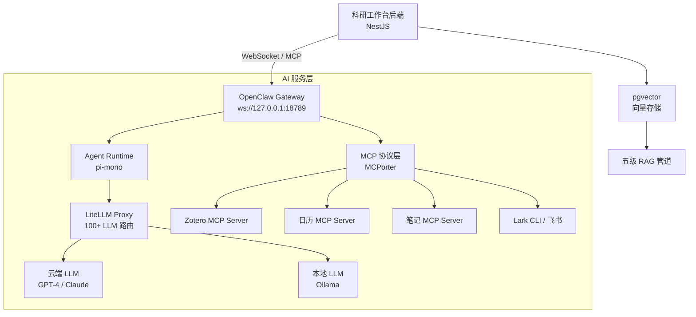

# AI 驱动的博士科研工作台：完整技术架构方案

> **文档类型**: 技术架构设计文档  
> **目标读者**: 博士研究者、独立开发者、开源贡献者  
> **核心项目**: OpenClaw 开源 AI 助手二次开发  
> **调研范围**: 前端、后端、数据库、AI 服务层、消息桥接、部署运维、安全隐私  
> **调研深度**: 12 个技术维度 × 300+ 独立搜索 × 30+ 开源项目  
> **生成日期**: 2026-04-20

---

# 1. 项目概述与核心目标
---


AI 服务层是博士科研工作台的认知中枢，负责模型接入、知识检索、工具编排和核心 AI 功能的实现。该层采用"OpenClaw 作为 AI 操作系统 + MCP 作为工具总线"的架构范式，将大语言模型（Large Language Model, LLM）能力转化为科研工作台可消费的工程服务。整体架构遵循"黑盒集成"原则——OpenClaw Gateway 作为独立运行的 AI 服务节点，通过标准协议与科研工作台后端通信，两者在版本演进和功能边界上完全解耦。



### 5.1 OpenClaw 集成策略

#### 5.1.1 "黑盒集成"模式

OpenClaw（GitHub: openclaw/openclaw）是一个基于 TypeScript/Node.js 的开源 AI 个人助手框架，截至 2026 年 4 月拥有 361k stars、73.6k forks 和 1,686 名贡献者，采用 MIT 许可证[^95^]。其架构采用 Gateway-Centric 分布式微服务设计，Gateway 是单一控制面，Agent Runtime（pi-mono）负责推理循环[^167^]。Gateway 本质上是一个长生命周期的 Node.js 守护进程，拥有所有状态和连接，作为系统的应用服务器运行——一切数据流都通过它中转[^65^]。

科研工作台对 OpenClaw 的集成遵循"黑盒集成"（Black-box Integration）模式：OpenClaw 作为独立的 AI 服务进程运行，科研工作台后端仅通过其暴露的 WebSocket API 进行通信，不修改、不侵入 OpenClaw 的源代码。这种架构选择基于一个关键洞察——OpenClaw 本身已经完整覆盖了 AI 层所需的全部基础设施：多模型路由（自带 LiteLLM 集成）、技能安装系统（ClawHub 3,200+ 技能）、MCP 协议支持（200+ 服务器适配）、持久记忆、定时任务和多 Agent 协作。科研工作台不需要 Fork OpenClaw 并二次开发，而是将其视为一个独立的 AI 层"操作系统"。

该模式的工程优势体现在三个维度。第一，版本更新零摩擦——OpenClaw 采用日期版本号格式（如 v2026.4.15），更新频率高[^216^]，黑盒集成使得 `npm update` 即可完成上游同步，不干扰工作台功能。第二，AI 层与工作台层完全解耦，可独立升级、替换甚至横向扩展。第三，工作台后端只需实现一个轻量级 OpenClaw Client，而非复刻其完整的 Agent 基础设施。

#### 5.1.2 跟随上游更新机制

OpenClaw 的快速迭代节奏（v2026.3.22 单版本即包含 45+ 新功能、82 个 bug 修复和 20 个安全补丁）要求科研工作台建立稳定的跟随策略。三种主流策略的对比如下：

| 策略 | 实现方式 | 更新延迟 | 维护成本 | 风险 |
|------|---------|---------|---------|------|
| npm 依赖更新 | `package.json` 中声明 OpenClaw 版本 | 即时 | 低 | 破坏性变更需适配 |
| Git 子模块 | 将 OpenClaw 作为子模块引用 | 可控 | 中 | 需手动同步 |
| API 兼容层 | 在两者之间构建适配抽象 | 零 | 高（初期） | 过度工程化 |

推荐采用"npm 依赖更新 + 自动化回归测试"的组合策略。具体而言，科研工作台在 `package.json` 中锁定 OpenClaw 的 minor 版本（如 `~2026.4.0`），依赖 Dependabot 等工具自动创建 PR 进行补丁级更新；每个 minor 版本升级前在 staging 环境执行完整的 MCP 调用测试套件，验证 Gateway 协议兼容性。OpenClaw 的配置文件 `openclaw.json` 采用四层配置叠加模型（defaults < config.yaml < AgentConfig < 环境变量）[^161^]，科研工作台利用这一机制通过环境变量注入必要的配置覆盖（如 `OPENCLAW_GATEWAY_TOKEN`、`OLLAMA_HOST`），避免修改 OpenClaw 的核心配置[^130^]。

#### 5.1.3 OpenClaw Gateway 协议

Gateway 通过 WebSocket 提供类型化的请求/响应/事件协议，默认监听地址为 `ws://127.0.0.1:18789`。首帧必须完成 `connect` 握手，消息格式基于 JSON-RPC 2.0：

```json
// 请求
{"type":"req", "id": "<uuid>", "method": "<method>", "params": {...}}

// 响应
{"type":"res", "id": "<uuid>", "ok": true|false, "payload": {...}|"error": "..."}

// 事件（流式响应）
{"type":"event", "event": "<event-name>", "payload": {...}, "seq?": 123}
```

科研工作台后端作为 WebSocket Client 连接到 Gateway，通过 `agent` 方法发起 AI 请求。副作用方法（`send`、`agent`）需要幂等键（idempotency keys）以支持安全重试。Gateway 分发 `agent`、`chat`、`presence`、`health`、`cron` 等核心事件，科研工作台订阅 `agent` 事件以接收流式的 LLM 响应片段[^65^]。

从 Agent 视角看，OpenClaw 的工具和技能系统是统一的能力平面：TOOLS.md 定义运行时原生能力（Agent 能做什么），SKILLS.md 定义扩展能力（Agent 被扩展了哪些能力），MCP Server 则添加外部工具调用[^449^]。Agent 在规划时同时参考三者[^93^]，而调用 Skill 工具与调用 MCP 工具在接口层面没有区别——区别完全由 OpenClaw 运行时通过 MCPorter 层处理[^103^]。

### 5.2 LLM 接入与路由

#### 5.2.1 LiteLLM Proxy：统一 LLM 网关

LiteLLM 是开源 AI Gateway，为 100+ LLM 提供商提供统一的 OpenAI 兼容接口，已被 Netflix 等企业采用[^366^]。在科研工作台架构中，LiteLLM Proxy 作为独立服务运行，P95 延迟仅 8ms（1k RPS 负载下），承担三项核心职责：

**统一接口层**。无论底层是 OpenAI GPT-4、Anthropic Claude、DeepSeek 还是本地 Ollama 实例，LiteLLM 都将它们封装为一致的 OpenAI Chat Completions API。这消除了提供商特定代码路径的维护负担——尽管主要 LLM API 的 Tool Calling 架构基本相似，细微差异仍迫使开发者维护多个代码分支[^392^]，LiteLLM 通过协议抽象层解决了这一问题。

**成本追踪与治理**。LiteLLM 精确追踪每次请求的 Token 用量和成本，支持按虚拟密钥（Virtual Key）设置预算上限和速率限制。科研工作台可以为不同功能模块（日记生成、文献摘要、日程优化）分配独立的虚拟密钥，实现细粒度的成本管控。

**容错与降级**。当主模型失败或触发速率限制时，LiteLLM 自动按预设策略重试备用模型（如 GPT-4 → Claude → DeepSeek），确保 AI 服务的高可用性。

#### 5.2.2 模型路由策略

科研工作台采用分层模型路由策略，根据任务特性和数据敏感度动态选择模型：

| 任务类型 | 路由目标 | 选择依据 |
|---------|---------|---------|
| 复杂推理（实验设计、文献综述） | 云端大模型 GPT-4 / Claude | 需要最强推理能力，成本可接受 |
| 常规任务（摘要生成、日程优化） | 经济模型 DeepSeek / GPT-3.5 | 成本敏感，质量要求中等 |
| 敏感数据处理（未发表想法、私人笔记） | 本地 Ollama（Llama 3 / Qwen） | 数据不出本地设备 |
| 高吞吐批量任务 | 批处理 API（50% 折扣） | 非实时，成本最优 |

本地优先策略不仅是部署选项，更是博士科研的数据主权策略——未发表的研究想法、AI 对话中的论文思路、文献批注暴露的研究方向，都属于需要严格留在用户设备上的"学术机密"。Ollama 作为本地模型运行器，在 Llama 3 8B Q4 量化下可达约 62 tok/s 的单用户吞吐[^398^]，足以满足科研工作台的日常 AI 任务。语义缓存可在企业 LLM 工作负载中实现 40-70% 的成本降低[^406^]，结合前缀感知路由（prefix-aware routing），静态内容（系统提示、技能定义）前置可使输入 Token 计算减少 60-80%[^405^]。

### 5.3 RAG 与知识检索

#### 5.3.1 五级 RAG 优化架构

RAG（Retrieval-Augmented Generation，检索增强生成）是科研工作台知识能力的核心技术。生产级 RAG 不是单一组件，而是一个五级递进的优化架构[^434^]：

**Level 1 — 语义分块（Semantic Chunking）**。相比固定长度分块，语义分块按语义边界切分文本，保持意义完整性，可带来 9-70% 的召回率提升[^434^]。科研工作台的 Markdown 笔记分块采用"标题感知分块"策略：以 Markdown 标题为边界，将同一章节的内容作为独立块，同时为每个块注入文档标题、章节层级等上下文元数据，解决"孤儿块"问题[^371^]。

**Level 2 — 混合检索（Hybrid Search）**。结合向量相似度搜索和关键词搜索（BM25），通过 Reciprocal Rank Fusion (RRF) 融合结果。混合搜索在精确匹配查询上表现优于纯向量搜索[^408^]，特别适合科研文献中专业术语和特定实体名称的检索。

**Level 3 — 交叉编码器重排序（Cross-encoder Reranking）**。在混合检索获取 Top-K 候选块后，交叉编码器模型联合编码查询-文档对，计算细粒度相关性分数，重新排序后选取 Top-N 传入 LLM。这一步骤可提升 15-48% 的整体检索质量[^434^]。

**Level 4 — 上下文扩展（Contextual Enrichment）**。为每个检索块附加前置上下文（如文档摘要、相邻段落），帮助 LLM 理解块的完整语义。

**Level 5 — 查询缓存与评估框架**。语义缓存通过向量嵌入测量查询相似性，可在高查询重叠场景中实现 30-60% 的缓存命中率[^406^]。同时建立评估框架（Recall@K > 90%、Precision@K > 80%），以数据驱动方式持续优化检索质量。

#### 5.3.2 笔记 RAG 管道

科研工作台的笔记 RAG 管道遵循"写入时分块、查询时检索"的范式：

```
Markdown 笔记写入 → 标题感知分块 → 嵌入模型(text-embedding-3) → pgvector 存储
                                                                    ↑
用户查询 → 查询向量化 → 混合搜索(向量+BM25+RRF) → 交叉编码器重排序 → Top-5 块注入上下文 → LLM 生成
```

pgvector 作为 PostgreSQL 的向量扩展，在单一数据库中同时满足关系型查询和向量搜索需求。嵌入模型选用 OpenAI 的 text-embedding-3-small（1,536 维度），在质量与成本之间取得平衡。笔记的 YAML frontmatter（标签、创建时间、状态）作为元数据过滤条件，在向量搜索前先行过滤，既提升相关性又降低搜索空间。

#### 5.3.3 文献 RAG 管道

文献 RAG 管道在笔记 RAG 的基础上增加了 PDF 解析和结构化提取环节：

```
PDF 上传 → PyMuPDF/Docling 解析 → 结构化文本提取 → 语义分块 → pgvector 嵌入 → 索引构建
                                                                                      ↑
用户提问 → 混合检索 → 重排序 → 上下文组装(文献摘要+相关段落+笔记批注) → LLM 生成答案
```

PDF 解析选用 PyMuPDF（综合学术评估中在文本提取方面总体最优）[^14^] 作为默认解析器，对复杂排版文献回退到 Docling（IBM 开源，55K+ stars，使用专门的布局分析模型）[^17^]。GROBID 用于学术文献的深度结构化提取（标题、作者、参考文献，F1 ~0.87）[^16^]，在需要自动生成文献引用关系时启用。

### 5.4 MCP 协议生态

#### 5.4.1 MCP 架构

MCP（Model Context Protocol，模型上下文协议）是由 Anthropic 于 2024 年 11 月推出的开放标准，灵感来自 Language Server Protocol (LSP)，用于标准化 AI Agent 与外部工具和数据源之间的交互[^420^]。截至 2026 年 2 月，MCP 生态系统已包含 177,436 个工具注册，其中 67% 集中在软件开发领域[^416^]。

MCP 采用 **Host-Client-Server** 三层架构[^441^]：**Host** 是发起连接的 LLM 应用（如 OpenClaw Gateway）；**Client** 是 Host 内维护与 Server 1:1 连接的组件，负责工具发现和请求代理；**Server** 是暴露外部功能和数据的独立程序。协议定义三种核心能力类型：**Tools**（可执行函数）、**Resources**（只读数据源）和 **Prompts**（可复用提示模板）[^416^]。

OpenClaw 通过内置的 MCPorter 工具层管理 MCP Server，支持 stdio 和 HTTP/SSE 两种传输方式[^94^]，无需重启 Gateway 即可添加或更改 MCP Server[^450^]。从 Agent 角度看，调用 Skill 工具与调用 MCP 工具在接口上没有区别[^103^]，这意味着科研工作台只需配置 MCP Server 连接，即可将外部工具无缝纳入 AI 的能力平面。

#### 5.4.2 已集成的 MCP Servers

科研工作台预集成以下 MCP Server，覆盖文献管理、日程协调、笔记访问和团队沟通四大领域：

| MCP Server | 仓库 | 功能描述 | 能力类型 | 传输方式 |
|-----------|------|---------|---------|---------|
| **zotero-mcp-server** | github.com/54yyyu/zotero-mcp [^5^] | 语义搜索（基于 ChromaDB）、PDF 批注提取、Scite 引用分析、通过 DOI 添加文献 | Tools + Resources | stdio |
| **zotero-mcp-claude-code** | github.com/lricher7329/zotero-mcp-claude-code [^6^] | Zotero 插件形式 MCP Server，内置 Streamable HTTP，支持写入操作 | Tools | HTTP |
| **zotero-write-mcp** | github.com/rcesaret/zotero-write-mcp [^8^] | 混合 API 模式（本地读取 + Web API 写入），18 个工具，18 个工具含创建/编辑/标签管理 | Tools | stdio |
| **日历 MCP Server** | 社区实现 | 读取/创建日历事件、查询空闲时段、管理日程冲突 | Tools + Resources | stdio |
| **笔记 MCP Server** | 自定义开发 | 暴露笔记数据给 AI，支持笔记创建、查询、语义搜索 | Tools + Resources | stdio |
| **Lark CLI** | 飞书官方 | 连接飞书，2,500+ API，19 个 AI Skills，支持消息收发和文档协作 | Tools | HTTP |

zotero-mcp-server 是最成熟的 Zotero MCP 实现，支持基于 sentence-transformers 的语义向量搜索、PDF 高亮与批注提取（含页码定位）、以及通过 DOI 自动获取元数据并添加文献[^5^]。科研工作台采用"zotero-mcp-server 作为主服务 + zotero-write-mcp 作为写入补充"的双 Server 策略，覆盖读取、搜索和写入的完整操作集。

这一集成模式体现了 MCP 的核心价值——"一次集成，无限扩展"。科研工作台只需在 OpenClaw 的 `openclaw.json` 中配置 `mcpServers` 块，AI Agent 即可自动发现所有 MCP Server 暴露的工具及其 JSON Schema，无需为每个外部工具编写专门的集成代码。新工具集成的时间从"天"降至"小时"。

#### 5.4.3 自定义 MCP Server 开发

对于科研工作台特有的功能（如番茄钟数据查询、实验记录访问、项目进度追踪），需要开发自定义 MCP Server。自定义 Server 使用 TypeScript 和 `@modelcontextprotocol/sdk` 构建，通过 stdio 与 OpenClaw MCPorter 通信。每个 Server 需要实现 `tools/list`（工具发现）和 `tools/call`（工具调用）两个核心方法。Server 将科研工作台的内部数据模型（如 PomodoroSession、ExperimentLog）暴露为 MCP Tool，使 AI Agent 能够查询"用户今天下午的番茄钟记录"或"本周完成了哪些实验步骤"。

### 5.5 核心 AI 功能实现

科研工作台的四大核心 AI 功能——智能日程、AI 日记、AI 文献管理、技能安装——在架构上共享同一套 LLM 接入和 RAG 检索基础设施，但在业务逻辑和数据流上各有差异。

| AI 功能 | 核心技术 | 数据源 | 自动化层级 | LLM 路由策略 |
|---------|---------|--------|-----------|------------|
| **智能日程安排** | chrono-node + 约束满足求解 + 日历 API | 日历事件、番茄钟历史、用户偏好 | Level 3（AI 建议，用户确认） | 经济模型 |
| **AI 日记生成** | 信号源融合 + RAG 检索 + LLM 生成 | 日程 + 番茄钟 + 笔记编辑历史 | Level 3-4（草稿生成，可编辑） | 经济模型 / 本地模型 |
| **AI 文献管理** | Zotero MCP + PDF 语义搜索 + 自动摘要 | Zotero 库、PDF 全文、批注 | Level 3（AI 辅助，用户审核） | 云端大模型 |
| **技能安装系统** | OpenClaw 技能机制 + ClawHub 市场 | ClawHub 3,200+ 技能 [^144^] | Level 2（用户发起，AI 协助） | 经济模型 |

#### 5.5.1 智能日程安排

智能日程模块采用"自然语言解析 + 约束满足求解 + 日历 API 集成"的三段式架构。**chrono-node** 负责自然语言时间解析（如"下周三下午三点" → ISO 8601 时间戳），将用户的自然语言输入转化为结构化时间数据。约束满足求解器（Constraint Satisfaction Solver）处理更复杂的调度逻辑：用户定义约束条件（如"每天至少有 2 小时深度学习时间"、"组会前 1 小时不安排其他任务"），求解器在满足所有约束的前提下生成最优日程安排。日历 MCP Server 将生成的日程写入用户的日历服务（Google Calendar / Apple Calendar），同时通过飞书 Lark CLI 发送提醒。

番茄钟数据是该模块的关键信号源——它不只是时间管理记录，更是用户行为的"结构化传感器"。每个番茄钟记录了"什么时间、做了什么任务、持续了多久、是否被打断"，长期数据揭示用户的高效时段和注意力模式，为 AI 优化日程安排提供数据基础。

#### 5.5.2 AI 日记生成

AI 日记生成是科研工作台最具特色的 AI 功能，其架构设计揭示了一个深层洞察：三层笔记架构与 RAG 检索层天然同构。my_journal_sys 的三层结构（快速捕获 → 提炼加工 → 应用层）与 RAG 系统的数据流完全一致——Layer 1（捕获层）对应 RAG 的原始文档注入，Layer 2（加工层）对应 RAG 的分块/嵌入/索引过程，Layer 3（应用层）对应 RAG 的检索/生成输出。

这意味着日记系统不需要"另外构建"RAG 能力——日记的整理过程本身就是 RAG 的构建过程。当 AI 需要"根据今日日程生成日记"时，它实际上是在对自己的知识库做一次 RAG 检索。

具体实现上，AI 日记生成遵循"信号源融合 → RAG 检索 → LLM 生成"的管道：

**信号源融合（Signals Ingestion）**。系统从多个数据源收集当日活动信号：日历事件（参加了哪些会议）、番茄钟记录（在哪些任务上投入了多少时间）、笔记编辑历史（编辑了哪些笔记、添加了什么内容）。番茄钟数据提供了比日程更颗粒度的"实际做了什么"信息，是日记内容的核心素材。

**RAG 检索**。将融合后的结构化数据（时间线格式）作为查询输入笔记 RAG 系统，检索与用户当日活动相关的历史笔记、项目文档和文献批注。这为日记生成提供了个人化的上下文——"今天阅读的论文与你上周的某个想法相关"。

**LLM 生成**。使用日记模板引擎（支持标准版、低能量版、项目复盘、对话式反思等多种模板[^806^]），将信号数据和 RAG 检索结果组装为提示词，由 LLM 生成日记草稿。生成后进入用户审阅环节，用户可以编辑、批准或丢弃草稿，审阅后的内容以 Markdown 格式存储并自动触发向量索引更新。

AI 日记生成技术的自动化程度可分为 4 个层级[^512^]：Level 1（用户完全手动写作）、Level 2（AI 提供提示词引导）、Level 3（AI 从信号源收集数据生成草稿供用户审阅）、Level 4（全自动隔夜生成）。科研工作台默认在 Level 3 运行，兼顾自动化效率与人文反思价值——毕竟"选择词语的内省行为"本身就是日记的意义所在[^512^]。

#### 5.5.3 AI 文献管理

AI 文献管理模块通过"Zotero MCP 查询 + PDF 语义搜索 + 自动摘要/标签生成"实现文献工作流的智能化。Zotero 7 内置本地 HTTP API（监听 `127.0.0.1:23119`）[^1^]，提供只读访问；写入操作通过 Zotero Web API（速率限制 120 请求/分钟）[^3^] 完成。zotero-mcp-server 将这一能力集暴露给 AI Agent，支持关键词搜索、语义向量搜索（基于 ChromaDB）、PDF 批注提取（含页码）、通过 DOI 自动添加文献、Scite 引用统计分析等功能[^5^]。

当用户上传新 PDF 时，系统触发异步处理管道：PyMuPDF 提取全文文本 → Docling 进行结构化解析（识别标题、摘要、章节、表格）[^17^] → 语义分块 → pgvector 嵌入索引。同时 LLM 自动生成文献摘要和推荐标签（基于 Zotero 已有标签体系：unread / in-progress / read / important / to-summarize[^37^]）。用户在阅读过程中，可随时向 AI 提问"这篇论文的方法论部分有哪些局限性？"，系统通过文献 RAG 管道检索相关段落并生成回答。

#### 5.5.4 技能安装系统

科研工作台复用 OpenClaw 的技能机制（Skills）作为 AI 能力扩展系统。技能是 Markdown 指令文件（`SKILL.md`），包含 YAML frontmatter 和自然语言指令，用于改变 Agent 的推理方式——它们添加领域知识和工作流模式[^93^]。与 MCP Server（添加外部工具调用能力）形成互补：Skills 改变 Agent 的思维方式，MCP 改变 Agent 能做什么。

ClawHub 是 OpenClaw 的官方技能市场，截至 2026 年已托管超过 3,200 个技能（另有来源统计超过 10,700 个），涵盖 CRM、开发者工具、数据、生产力等类别[^144^]。科研工作台用户可以通过 `npx clawhub@latest install <skill-name>` 安装所需技能，例如：

- 学术研究技能：文献综述模板、实验设计检查清单、论文写作指南
- 数据分析技能：统计方法选择、可视化最佳实践、Python/R 代码模板
- 项目管理技能：敏捷科研方法论、里程碑追踪、风险识别框架

技能与 MCP Server 的组合使用创造了强大的工作流——例如安装"文献综述"技能（定义文献综述的结构化方法论）后，结合 zotero-mcp-server（访问文献数据），AI Agent 可以自主执行"搜索相关文献 → 提取关键发现 → 按主题组织 → 生成综述段落"的完整工作流。值得注意的是，安全分析发现约 8% 的 ClawHub 技能含有恶意代码[^144^]，生产环境应启用 OpenClaw 的六层安全模型（Gateway 认证 → 工具策略 → 沙箱隔离 → 密钥管理 → 外部内容防御 → 安全审计）[^222^]进行防护。

---

## 6. 多设备同步与消息桥接
