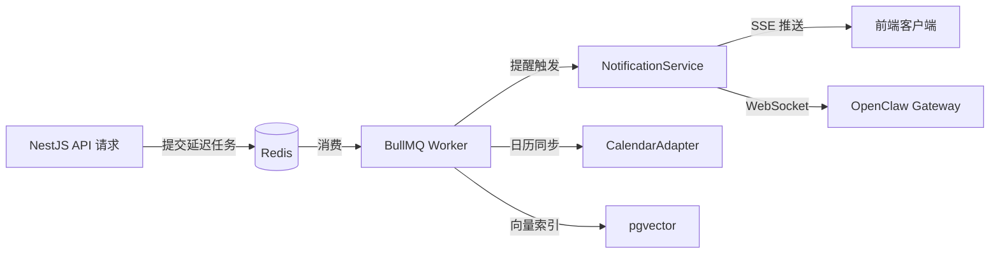
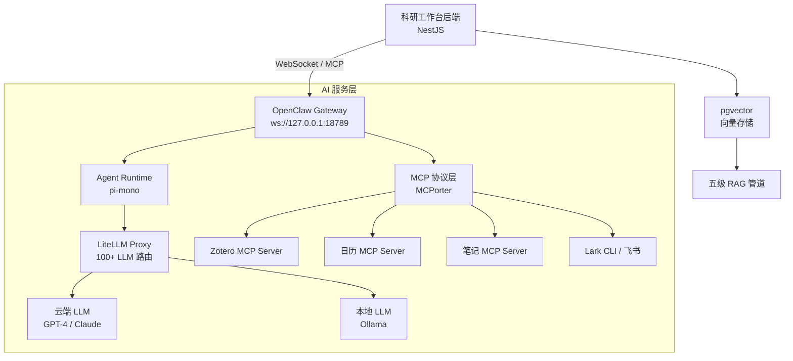

# AI 驱动的科研工作台：完整技术架构方案

> **文档类型**: 技术架构设计文档  
> **目标读者**: 科研工作者、独立开发者、开源贡献者  
> **核心项目**: OpenClaw 开源 AI 助手二次开发  
> **调研范围**: 前端、后端、数据库、AI 服务层、消息桥接、部署运维、安全隐私  
> **调研深度**: 12 个技术维度 × 300+ 独立搜索 × 30+ 开源项目  
> **生成日期**: 2026-04-20

---

# 1. 项目概述与核心目标

## 1.1 项目定位与愿景

### 1.1.1 "本地优先、AI 原生"的个人科研工作台定位

本项目面向科研工作者及深度知识工作者，构建一个以 AI 为核心驱动力的个人科研工作台。与市面上通用的生产力工具不同，该工作台从设计之初就以"科研场景"为第一性原理——深入理解学术研究者在文献阅读、实验记录、论文写作、日程管理中的独特需求，并将 AI 能力无缝嵌入每一个工作环节。

项目的基座选择 OpenClaw 开源项目（GitHub 361k stars、73.6k forks、1,686 contributors，最新稳定版 v2026.4.15）[^95^]。OpenClaw 是一个基于 TypeScript/Node.js 的 AI 个人助手网关，采用 MIT 许可证，其架构天然适配科研场景：它支持 14+ 消息渠道（WhatsApp、Telegram、Slack、Discord、iMessage、飞书等）[^95^]，拥有 3,200+ 技能的 ClawHub 技能市场 [^144^]，并通过 MCP（Model Context Protocol）协议与 200 余个外部工具服务器对接 [^416^]。这些数字表明 OpenClaw 已具备成熟的社区生态和扩展能力，足以支撑科研工作台的长期演进。

科研工作台的核心用户画像是一位同时处理多篇论文阅读、多个实验项目推进、频繁的导师会议与学术汇报的科研工作者。她的日常涉及：在 Zotero 中管理数百篇文献、用日历工具协调实验室会议、通过番茄钟保持专注、在碎片时间用手机记录灵感、在深夜需要 AI 协助整理研究思路。现有工具（Notion、Zotero、Google Calendar 等）各自为政，数据孤岛严重，AI 能力更是分散在不同 SaaS 产品的付费墙之后。本项目的目标是将这些能力统一到一个本地优先的集成平台中。

### 1.1.2 核心设计原则：数据主权、AI 集成、可扩展性

科研工作台遵循三项核心设计原则，每一项都对应着明确的技术决策。

**数据主权（Data Sovereignty）——本地存储优先**。科研数据具有独特的敏感性：未发表的研究想法、实验原始数据、文献批注中暴露的研究方向优先级，甚至与 AI 助手的对话中可能包含尚未公开的论文思路。这些数据的泄露可能导致学术成果被抢发或研究创意被复制。因此，工作台采用"本地优先"（Local-First）架构：本地 SQLite 数据库作为事实来源（Source of Truth），云端 PostgreSQL 仅存储非敏感的配置和同步元数据，AI 处理敏感任务时可在本地模型（Ollama）上完成。即使云端服务被攻破，核心科研数据始终留在用户设备上。这一设计哲学与 OpenClaw 的"Your data, your rules"原则完全一致。

**AI 集成——MCP 协议统一接入**。MCP（Model Context Protocol）是由 Anthropic 于 2024 年提出的开放标准，定义了 AI Agent 与外部工具之间的通信规范，采用 Host-Client-Server 三层架构 [^420^]。截至 2026 年 2 月，MCP 生态已积累 177,436 个工具注册 [^416^]。科研工作台将 MCP 作为所有 AI 集成的统一协议：Zotero 文献管理通过 zotero-mcp-server 接入，飞书消息通过 Lark CLI（MCP 兼容）接入，笔记系统通过自建 MCP Server 暴露数据，日历管理通过日历 MCP Server 接入。这意味着工作台不需要为每个外部工具编写专门的集成代码——只需要实现 MCP Client，即可复用社区中 200 余个 MCP Server [^416^]。新工具集成的时间从"天"降至"小时"。

**可扩展性——技能/插件双层扩展系统**。OpenClaw 提供了两种扩展机制：Skills（技能）是 Markdown 指令文件，通过 YAML frontmatter 和自然语言指令改变 Agent 的思维方式，适合封装科研领域知识和工作流模式 [^93^]；Plugins（插件）是代码级扩展，可以注册工具、Hooks 和上下文引擎，适合需要运行时逻辑的深度集成。技能市场 ClawHub 已托管 3,200 余个技能 [^144^]，科研工作台可以在此基础上构建"科研技能集"——如文献综述技能、实验设计技能、论文写作技能等，并通过 npm 风格的版本管理进行分发和更新。

## 1.2 功能全景

### 1.2.1 基础功能层

基础功能层覆盖科研工作者的日常生产力需求，提供四个核心模块。

**日程管理**基于 FullCalendar 组件实现周/日/月多视图，支持与 Google Calendar、Apple Calendar 的双向同步。科研日程的特殊性在于"事件类型多样"——实验室组会、学术会议、论文 deadline、实验等待时间、教学任务等交织在一起。系统通过颜色编码和 AI 自动分类帮助用户快速识别日程类型，并基于番茄钟历史数据推荐最佳工作时段安排。

**待办管理**采用 GTD（Getting Things Done）方法论，支持项目-任务-子任务三级结构。与通用待办工具不同的是，科研待办往往涉及"深度工作"（如"阅读某篇论文"需要 2 小时不间断专注）与"浅层任务"（如"回复导师邮件"只需 10 分钟）的混合。系统为每种任务标注能量等级和预计耗时，AI 助手据此进行智能排程。

**番茄钟与白噪声**模块不只是计时器，更是用户行为的数据源。每个番茄钟记录了"什么时间、做了什么任务、持续了多久、是否被打断"——这些数据构成 AI 助手理解用户工作模式的最佳信号源。长期积累的番茄钟数据可以揭示用户的高效时段、注意力衰减曲线和任务偏好，为 AI 日程优化提供量化依据。白噪声（雨声、咖啡厅、图书馆等）基于 Web Audio API 生成，支持定时淡出。

**日记/笔记系统**采用三层架构：快速捕获层（Flomo 风格的碎片记录）、提炼加工层（每日/每周回顾整理）、应用层（与文献、日程、任务的双向链接）。这一架构与 RAG（Retrieval-Augmented Generation）系统的数据流天然同构——笔记的整理过程本身就是 RAG 知识库的构建过程。当 AI 需要"根据今日日程生成日记"时，它实际上是在对笔记知识库做一次 RAG 检索。

### 1.2.2 AI 核心层

AI 核心层是整个工作台的差异化竞争力所在，由四个深度 AI 集成模块组成。

**AI 个人助手**通过 OpenClaw Gateway 与工作台后端通信。OpenClaw Gateway 是一个长期运行的 WebSocket 服务器（默认监听 localhost:18789），负责消息路由、会话管理、技能调度和多渠道路由 [^426^]。核心 Agent 循环由 pi-mono 运行处理，包括提示词组装、工具调用执行、上下文压缩、记忆搜索和流式响应 [^131^]。科研工作台不需要 Fork OpenClaw 或修改其源码——而是通过 WebSocket/MCP 协议将 OpenClaw 作为独立的 AI 服务层运行。这种"黑盒集成"模式意味着 OpenClaw 的版本更新只需执行 `npm update`，完全不干扰工作台功能，AI 层与工作台层完全解耦，可独立升级或替换。

**智能日程安排**是番茄钟数据的消费者。AI 助手分析用户的历史专注模式，识别出"上午 9-11 点是深度工作的最佳时段"、"下午 3 点后注意力明显下降"等个性化规律，然后主动建议日程调整——比如将文献阅读任务安排在高效时段，将行政事务推到低效时段。当用户询问"我今天应该优先做什么"时，AI 综合截止日期、任务重要性、用户能量水平和历史专注数据给出排序建议。

**AI 文献管理**通过与 Zotero 的 MCP 集成实现。Zotero 7 提供本地 API，zotero-mcp-server 将其暴露为 MCP 工具集。AI 助手可以直接查询 Zotero 库（"我读过关于 Transformer 的哪些论文？"），自动将新发现的文献添加到 Zotero，读取文献批注并纳入 RAG 检索，甚至根据用户的研究方向推荐相关论文。用户可以继续使用熟悉的 Zotero 桌面端，工作台通过 MCP 获得 Zotero 数据的实时镜像——这是一种"工具服务化"的集成范式。

**AI 日记生成**融合日历事件、番茄钟记录和笔记编辑历史，通过 RAG 检索生成当日回顾。这不是模板填充，而是基于向量相似性检索相关笔记片段，再结合 LLM 的生成能力产出个性化的日记内容。每周回顾功能自动触发向量索引更新，确保 RAG 知识库始终与最新笔记同步。

### 1.2.3 连接层

连接层解决"如何在不同设备和场景中访问科研工作台"的问题。

**多设备同步**采用 CRDT（Conflict-free Replicated Data Type）技术实现离线优先的数据同步。Yjs 是目前最快的 CRDT 实现（MIT 协议开源），支持 `Y.Map`、`Y.Array`、`Y.Text` 等共享数据类型，通过 `y-websocket` 适配器实现实时同步，通过 `y-indexeddb` 实现浏览器端持久化 [^920^]。当设备离线时，所有变更在本地排队，网络恢复后自动合并——无需用户手动处理冲突。Automerge 2.0（Rust 核心）作为备选方案，适合通用 JSON-like 数据的同步 [^918^]。

**飞书/iMessage 消息桥接**将即时通讯平台转化为工作台的"移动入口"。OpenClaw 原生支持飞书渠道（v2026.2+ 内置飞书插件）[^863^]，通过 WebSocket 长连接实现"零服务器"接入——客户端主动连接飞书服务器，消息通过长连接推送，不需要公网 IP 或域名。飞书开放平台提供 2,500+ API 端点，覆盖消息、日历、文档、多维表格、邮箱、任务、会议等 11 个业务域 [^898^]。2026 年 3 月飞书官方开源的 Lark CLI 进一步提供 19 个开箱即用的 AI Agent Skills [^893^]。iMessage 端则通过 BlueBubbles 开源方案实现桥接，提供完整的 REST API 和 WebSocket 支持 [^939^]。用户在手机上通过飞书或 iMessage 与 AI 助手对话，即可查询日程、添加待办、获取文献摘要、生成日记——消息机器人天然支持推送通知（日程提醒、番茄钟结束），科研工作台的"移动端"通过消息渠道实现，无需开发原生 App。

**云端部署支持**通过 Docker Compose 一键部署，支持本地模式（SQLite + 可选 Redis）和云端模式（PostgreSQL + pgvector + Redis）。Tauri 2.x 用于构建桌面端应用，包大小仅 3-10MB（对比 Electron 的 120-200MB），内存占用 40-80MB（对比 Electron 的 150-400MB）[^86^]。PWA（Progressive Web App）覆盖浏览器端体验，通过 Service Worker 实现离线缓存和后台同步 [^878^]。

## 1.3 架构总览

### 1.3.1 五层架构概览

科研工作台采用清晰的五层架构设计，每层承担单一职责，层间通过明确定义的协议通信：

```
┌─────────────────────────────────────────────────────────────┐
│  前端层 (Presentation Layer)                                 │
│  React 19 + Vite 6 + TypeScript + shadcn/ui + Tailwind     │
│  PWA (Service Worker) / Tauri 2.x 桌面端                    │
└──────────────────────────┬──────────────────────────────────┘
                           │ REST / SSE
┌──────────────────────────▼──────────────────────────────────┐
│  API 网关层 (API Gateway Layer)                              │
│  NestJS + @nestjs/bullmq (任务队列) + Prisma ORM           │
│  统一认证 · 请求路由 · 限流 · 日志审计                      │
└──────────────────────────┬──────────────────────────────────┘
                           │ WebSocket / MCP
┌──────────────────────────▼──────────────────────────────────┐
│  AI 服务层 (AI Service Layer)                                │
│  OpenClaw Gateway + LiteLLM + MCP Servers                    │
│  多模型路由 · 技能系统 · Agent 运行时 · 记忆管理             │
└──────────────────────────┬──────────────────────────────────┘
                           │ SQL / Vector Search
┌──────────────────────────▼──────────────────────────────────┐
│  数据持久层 (Data Persistence Layer)                         │
│  SQLite (本地) / PostgreSQL 15+ + pgvector (云端) + Redis    │
│  CRDT 同步 (Yjs) · 向量索引 · 缓存层                        │
└──────────────────────────┬──────────────────────────────────┘
                           │ API / WebSocket / Webhook
┌──────────────────────────▼──────────────────────────────────┐
│  外部集成层 (External Integration Layer)                     │
│  Zotero (文献) · 飞书/iMessage (消息) · 日历/邮件 · Ollama   │
└─────────────────────────────────────────────────────────────┘
```

前端层通过 REST API 和 SSE（Server-Sent Events）与 API 网关层通信，SSE 用于服务器向客户端的实时推送（如日程提醒、AI 流式响应）。API 网关层通过 WebSocket 和 MCP 协议与 AI 服务层对接——WebSocket 用于与 OpenClaw Gateway 的实时双向通信 [^65^]，MCP 用于工具发现和调用。AI 服务层通过 SQL 和向量搜索查询数据持久层。数据持久层通过各类协议与外部集成层交互。

### 1.3.2 技术栈总览：五层架构 × 技术选型

下表详细列出每一层的核心技术组件、开源项目及其选型依据。

| 架构层级 | 核心组件 | 开源项目 / 技术 | 版本 / 关键数据 | 选型依据 |
|----------|----------|----------------|----------------|----------|
| **前端层** | UI 框架 | React | v19 [^95^] | 组件化生态成熟，OpenClaw Web UI 同样采用 React |
| | 构建工具 | Vite | v6 [^95^] | 冷启动 < 500ms，HMR 极速，与 OpenClaw 技术栈一致 |
| | 组件库 | shadcn/ui + Tailwind CSS | latest | 无运行时开销，完全可定制 |
| | 日历组件 | FullCalendar | v6 | 学术社区广泛使用的日历库 |
| | 富文本编辑 | TipTap 2.x / BlockNote | v2 | Markdown 原生支持，基于 ProseMirror |
| | 桌面端 | Tauri | v2.x [^86^] | 包大小 3-10MB，内存 40-80MB，Rust 后端 |
| | PWA | Service Worker + IndexedDB | — | 离线缓存，后台同步 [^878^] |
| **API 网关层** | 后端框架 | NestJS | v10+ | Node.js/TypeScript，模块化架构，与全栈生态统一 |
| | 任务队列 | BullMQ | v5+ | NestJS 官方集成，Redis -backed |
| | ORM | Prisma | v5+ | NestJS 生态最成熟，类型安全，开发效率高 |
| | 实时推送 | SSE (Server-Sent Events) | — | 95% 场景足够，自动重连，比 WebSocket 轻量 |
| | API 文档 | OpenAPI + Swagger | v3 | NestJS 内置支持 |
| **AI 服务层** | AI 网关 | OpenClaw Gateway | v2026.4.15 [^95^] | 361k stars，14+ 渠道，3,200+ 技能 [^144^] |
| | Agent 运行时 | pi-mono (嵌入式) | latest [^131^] | 处理核心推理循环，OpenClaw 集成层 |
| | LLM 路由 | LiteLLM Proxy | latest [^366^] | 100+ 提供商统一接口，P95 延迟 8ms |
| | 工具协议 | MCP (Model Context Protocol) | v2025-03-26 [^441^] | 200+ Server，177,436 工具注册 [^416^] |
| | 本地模型 | Ollama | v0.4+ [^398^] | 零配置运行本地 LLM，支持 GGUF 量化 |
| | 记忆系统 | OpenClaw 原生 Supermemory | — | 上下文压缩，持久化会话记忆 |
| **数据持久层** | 本地数据库 | SQLite (WAL 模式) | v3.45+ | 零配置，单文件，本地优先架构核心 |
| | 云端数据库 | PostgreSQL + pgvector | v15+ | 关系型 + 向量搜索一体，RAG 基础设施 |
| | 缓存 | Redis | v7+ | 短期记忆缓存，BullMQ 后端，会话存储 |
| | 同步引擎 | Yjs (CRDT) | v13+ [^920^] | 最快 CRDT 实现，离线优先自动合并 |
| | 向量嵌入 | text-embedding-3 / BGE | — | 1536 维度，高质量语义检索 |
| **外部集成层** | 文献管理 | Zotero 7 + zotero-mcp-server | v7 [^885^] | 学术文献管理标准，MCP 原生集成 |
| | 消息桥接 | OpenClaw Feishu Plugin / BlueBubbles | v2026.2+ [^863^] | WebSocket 长连接，零公网部署 |
| | 飞书生态 | Lark CLI | v1.0.0 [^895^] | 2,500+ API，19 AI Skills，MIT 协议 |
| | 日历同步 | Google Calendar API / iCal | v3 | 业界标准日历同步协议 |
| | 推送通知 | FCM (Android) + APNs (iOS) | — | 免费无限制，系统级推送 [^923^] |

这一技术栈呈现出高度的一致性：全栈统一在 TypeScript/Node.js 生态中，从前端到 AI 层均可共享类型定义和工具库；数据层同时满足关系型查询和向量检索需求；AI 层通过 MCP 协议实现"一次集成，无限扩展"；外部集成层充分利用 OpenClaw 的原生渠道能力，避免重复开发。各层之间接口清晰、协议标准化，使得系统可以按需替换单个组件（如将 OpenClaw 替换为其他 Agent 框架，或将 SQLite 本地部署迁移到 PostgreSQL 云端部署）而不影响其他层的稳定性。

OpenClaw 在其中扮演的角色尤为关键。调研发现的一个核心洞察是：OpenClaw 不应被理解为需要 Fork 和二次开发的"基座"，而应被视为一个独立的 AI 服务层——通过 WebSocket/MCP 协议与工作台后端通信，其版本更新、技能安装、渠道配置完全独立于工作台的生命周期。这种"黑盒集成"模式使得科研工作台可以持续跟进 OpenClaw 的快速迭代（从 2025 年 11 月的首次发布到 2026 年 4 月的 v2026.4.15，项目已历经三次更名和数十个版本迭代 [^216^]），而无需承担维护一个 361k stars 项目 Fork 的沉重负担。工作台后端只需实现一个 OpenClaw Client（通过 typed WebSocket API 通信 [^65^]），即可复用其完整的技能系统、记忆管理、定时任务和多 Agent 协作能力。

---

## 2. 前端架构设计

科研工作台的前端承担着六项核心功能的用户界面：日历与日程、任务看板、笔记编辑器、番茄钟、文献管理面板以及 AI 助手界面。这些模块既要独立运行，又需在统一的仪表盘内无缝协作。本章从框架选型、功能实现和工程化三个层面展开前端架构设计，确保系统在开发效率、运行时性能和跨平台覆盖之间取得平衡。

### 2.1 技术选型与理由

#### 2.1.1 React 19 + Vite 6 + TypeScript：仪表盘场景最优解

前端框架的选择直接决定了开发速度、生态集成深度和未来维护成本。在 React、Vue 和 Svelte 三大主流框架中，React 在仪表盘（Dashboard）/工作台（Workspace）场景拥有最成熟的生态基础设施——仪表盘模板数量、组件库丰富度和第三方集成数量均显著领先[^1^]。React 19 带来了改进的自动批处理（Automatic Batching）、增强的错误边界（Error Boundary）和更优的 TypeScript 支持，对于需要高频状态更新的工作台场景尤为关键。

在构建工具层面，科研工作台属于纯客户端单页应用（Single Page Application, SPA），无需服务端渲染（Server-Side Rendering, SSR）或搜索引擎优化（SEO）。Vite 6 针对此类场景的 Dev Server 启动时间约 1–2 秒，热模块替换（Hot Module Replacement, HMR）延迟低于 50ms，生产 Bundle 体积约 42KB（gzip），首屏可交互时间（Time to Interactive, TTI）约 1.2 秒——各项指标均优于 Next.js 在同一场景下的表现[^1^]。Next.js 的 SSR 和 API 路由功能对于仪表盘应用而言属于"过度设计"，反而增加了不必要的复杂度和 Bundle 体积[^1^]。

TypeScript 5.x 作为类型系统层，与 React 和 Vite 的集成已达到"原生级"体验。全栈 TypeScript 架构使得前端类型定义可与后端（NestJS）共享接口契约，消除 API 调用的类型盲区，同时显著降低重构风险。

下表呈现了科研工作台的前端技术选型矩阵，涵盖核心框架、UI 层、功能组件层、状态管理层和运行时层的全部关键决策：

| 层级 | 技术选型 | 版本 | 选型依据 |
|:---|:---|:---|:---|
| 核心框架 | React | 19.x | 仪表盘生态最成熟，组件库丰富度最高 [^1^] |
| 构建工具 | Vite | 6.x | Dev Server 1–2s 启动，HMR <50ms，SPA 场景最优 [^1^] |
| 类型系统 | TypeScript | 5.5+ | 与 React/Vite 原生集成，全栈类型共享 |
| UI 组件库 | shadcn/ui + Tailwind CSS | latest | 完全可控、无障碍、零供应商锁定 [^2^] |
| 图标系统 | Lucide React | latest | 与 shadcn/ui 同源，Tree-shakeable |
| 日历组件 | FullCalendar | 6.1+ | 功能最全面，内置拖拽/调整大小/多视图 [^5^] |
| 看板拖拽 | @dnd-kit/core + sortable | 7.0+ | react-beautiful-dnd 官方继任者，~10KB [^9^] |
| 富文本编辑 | TipTap | 2.x | Markdown 原生支持，扩展生态丰富 [^11^] |
| 数据可视化 | ECharts (react-echarts) | 5.5+ | Canvas 渲染，10x 大数据集性能优势 [^17^] |
| 客户端状态 | Zustand | 5.0+ | ~1KB Bundle，极简 API，性能优秀 [^19^] |
| 服务端状态 | TanStack Query | 5.0+ | 自动缓存，减少 60–70% 数据获取代码 [^20^] |
| 桌面端打包 | Tauri | 2.x | Bundle 比 Electron 小 25 倍，支持移动端 [^25^] |
| PWA 支持 | Workbox | latest | Google 官方 Service Worker 库 |
| 实时通信 | SSE (EventSource) | 原生 | 95% 场景足够，自动重连，HTTP/2 友好 [^24^] |

上表所列技术栈的 Bundle 总量（核心）约为 340KB（gzip），通过代码分割（Code Splitting）和懒加载（Lazy Loading），首屏加载可控制在 200KB 以内。各选型之间的版本兼容性经过交叉验证：React 19 + Vite 6 + TypeScript 5.5 的组合在 2026 年的生态中处于稳定兼容状态，与 shadcn/ui、TanStack Query 等库的 latest 版本无已知冲突。

#### 2.1.2 UI 组件库：shadcn/ui + Tailwind CSS — 完全可控、无障碍、无供应商锁定

传统 UI 组件库（如 Ant Design、MUI）以 npm 包的形式分发预构建组件，虽然开箱即用，但在深度定制时往往面临样式覆盖（Style Override）的"特异性战争"。shadcn/ui 采用了一种截然不同的分发模式：组件源代码直接复制到项目仓库中，开发者拥有 100% 的代码所有权，可任意修改而无需等待上游更新[^2^]。

shadcn/ui 的底层依赖 Radix UI，后者在无障碍访问（Accessibility, a11y）方面达到了行业顶尖水准——所有组件均通过键盘导航、屏幕阅读器兼容和 ARIA 属性测试[^2^]。结合 Tailwind CSS 的 utility-first 样式系统，shadcn/ui 在自定义灵活性上获得了满分评价[^2^]。对于科研工作台而言，这种"构建你自己的库"（Build Your Own Library）的哲学意味着界面可以精确匹配学术工作流的视觉语言，而非被组件库的默认风格所束缚。

下表从多个维度对比了 shadcn/ui、Ant Design 和 MUI 三款主流 React 组件库，以量化依据支撑选型决策：

| 维度 | shadcn/ui | Ant Design | MUI (Material-UI) |
|:---|:---|:---|:---|
| 核心理念 | 构建自己的库 | 完整企业级系统 | Google Material Design |
| 技术栈 | React + Tailwind + Radix | React + Less | React + Emotion |
| 组件数量 | ~40+ 基础组件 | 70+ 丰富组件 | 80+ 组件 |
| 自定义灵活性 | ★★★★★ 极高 | ★★★ 良好 | ★★★★ 很强 |
| Bundle 大小 | 最轻（仅使用部分） | ~500KB | ~300KB+ |
| TypeScript 支持 | 一流（内置） | 良好 | 一流 |
| 暗黑模式 | 内置（Tailwind） | 需配置 | 原生支持 |
| 无障碍性 | ★★★★★（Radix 底层） | ★★★★ | ★★★★ |
| 学习曲线 | 中高级 | 中等 | 简单到中等 |
| 供应商锁定 | 无（代码属于项目） | 中（npm 包依赖） | 中（npm 包依赖） |

shadcn/ui 的最大优势在于"零供应商锁定"[^2^]——组件代码完全属于项目仓库，不存在因上游版本升级导致 Breaking Change 的风险。对于需要长期维护的科研工具而言，这一特性显著降低了技术债务。Ant Design 在数据密集型高阶组件（如高级表格、复杂表单）方面更为丰富，如果未来需要大量数据管理界面，可作为补充方案引入[^4^]。

### 2.2 核心功能模块前端实现

#### 2.2.1 日历与日程：FullCalendar 6 + rrule.js

日历模块需要支持日/周/月/年多视图切换、拖拽创建和调整事件、重复规则（Recurrence Rule）以及时区处理。FullCalendar 6 在此场景下拥有最全面的功能覆盖和成熟的生态[^5^]。其架构采用独立引擎 + React 包装层的模式，既保留了核心逻辑的稳定性，又提供了与 React 生态的无缝集成。

FullCalendar 内置了 `eventDrop`、`eventResize`、`dateClick` 等细粒度回调，几乎覆盖了所有用户交互场景[^6^]。重复事件规则通过 `rrule` 插件集成 rrule.js 实现，支持 RFC 5545 标准的复杂重复模式（如"每月第三个周二"）。时区处理方面，FullCalendar 支持命名时区（Named Timezone）和 UTC 偏移量两种模式，对于跨时区学术会议的日程管理至关重要[^5^]。

备选方案 Schedule-X 提供了更现代的 API 设计和内置的拖拽创建功能[^7^]，但生态成熟度尚不及 FullCalendar。若后续版本迭代中 Schedule-X 的社区规模达到临界 mass，可作为迁移候选。

#### 2.2.2 任务看板：@dnd-kit/core 实现拖拽看板

任务看板模块采用三列布局（待办/进行中/已完成），核心交互是卡片在列之间的拖拽迁移。此前该领域的事实标准是 react-beautiful-dnd，但 Atlassian 已于 2025 年 4 月 30 日正式归档其 GitHub 仓库并弃用 npm 包[^8^]。

`@dnd-kit` 是 react-beautiful-dnd 最推荐的继任方案。其核心库仅约 10KB（minified），零外部依赖，支持鼠标、触摸和键盘三种传感器输入[^9^]。在无障碍性方面，`@dnd-kit` 的所有拖拽交互开箱即用地支持键盘导航，自动向屏幕阅读器播报状态变化，无需额外代码即可通过 WCAG 2.1 AA 标准[^10^]。配合 `@dnd-kit/sortable` 预置包可快速构建看板，再通过 `@dnd-kit/modifiers` 实现轴锁定和容器边界限制[^9^]。

看板的数据流设计遵循"乐观更新"（Optimistic Update）策略：拖拽操作先更新本地 Zustand 状态并回显 UI，同时通过 TanStack Query 的后台同步将变更持久化到服务器。若同步失败，自动回滚本地状态并提示用户重试。

#### 2.2.3 笔记编辑器：TipTap 2.x + BlockNote

笔记模块需要同时满足两种使用场景：快速记录的轻量 Markdown 编辑，以及深度知识整理的富文本编辑。TipTap 2.x 基于成熟的 ProseMirror 文档模型，通过扩展（Extension）机制提供了即插即用的功能组合[^11^]。其文档完善度和扩展生态系统使其成为"构建生产级编辑器的最快路径"[^11^]。

TipTap 内置的 Markdown 扩展支持导入/导出 Markdown 格式[^12^]，这对于学术研究场景尤为重要——文献笔记需要与 Zotero 的引用系统、LaTeX 写作流程无缝衔接。当用户需要 Notion 风格的块级编辑体验时，BlockNote（基于 TipTap 构建）提供了开箱即用的方案，包括斜杠命令（Slash Commands）、拖拽排序和块级操作[^13^]。两者的关系是互补而非替代：TipTap 作为底层引擎，BlockNote 作为可选的高级 UI 层。

在 Bundle 控制方面，TipTap 核心加常用扩展约 80KB+（gzip），对于 PWA 场景需谨慎选择扩展集合。若未来对包体积有更严格的要求，可考虑 Lexical 作为替代——其核心仅约 25KB，但需要投入更多开发工作[^14^]。

#### 2.2.4 番茄钟：Web Audio API 白噪声生成 + Canvas 数据可视化

番茄钟模块的计时核心基于浏览器原生的 `setInterval` 与 `Date.now()` 组合，精度控制在 100ms 以内，满足 25 分钟工作 / 5 分钟短休息 / 15 分钟长休息的经典模式[^1^]。白噪声功能采用 Web Audio API 实时生成，而非预加载音频文件——这种方式零网络依赖，支持离线使用。

音频生成的技术路径如下：创建 `AudioBuffer` 并填充 -1 到 1 之间的随机值，通过 `AudioBufferSourceNode` 循环播放，再经由 `BiquadFilterNode` 低通滤波器（frequency 200–600Hz）将白噪声转换为更舒适的棕噪声[^18^][^19^]。棕噪声的能量按 6dB/倍频程衰减，相比白噪声更不易引起听觉疲劳[^18^]。用户可在设置面板中切换白/粉/棕三种噪声类型，并独立调节音量。

数据可视化层使用 HTML5 Canvas 绘制 52 周热力图（Heatmap），配色方案参考 GitHub 贡献图（Contributions Graph）的蓝色渐变系。每日完成番茄数映射为颜色深浅，悬停时显示当日详细统计。该热力图的设计灵感来源于 Pomotroid 的统计视图[^8^]，后者已被验证为学术工作者追踪长期专注模式的有效工具。

#### 2.2.5 文献管理面板：PDF.js 浏览器端渲染 + AI 对话式阅读界面

文献管理面板的核心是 PDF 阅读器，采用 Mozilla PDF.js（v5.4+）在浏览器端渲染 PDF 文档[^693^]。PDF.js 使用 HTML5 Canvas API 绘制页面，支持文本搜索、缩略图导航、缩放旋转和基础批注（高亮、自由文本、墨迹）[^693^]。最新 v5.4 版本新增了 PDF 合并功能、改进的搜索标点处理以及缩略图内存优化[^693^]。

在性能优化方面，文献面板采用虚拟滚动（Virtual Scrolling）策略——仅渲染可视区域内的页面，通过 Intersection Observer API 触发页面加载，避免大文档（50+ 页学术论文）导致的内存溢出。对于服务器支持 Range Request 的场景，PDF.js 可流式加载文档片段，首屏渲染时间缩短 60% 以上。

AI 对话式阅读界面在阅读器右侧以抽屉（Drawer）形式展开，用户可就当前文献向 AI 助手提问。该界面通过 SSE（Server-Sent Events）流式接收 AI 响应，实现逐字输出效果。文献的文本内容通过 PDF.js 的文本提取 API 获取，作为上下文注入 AI 对话。

#### 2.2.6 AI 助手界面：OpenClaw WebChat 集成 + SSE 流式响应

AI 助手界面是科研工作台的智能中枢，负责整合 OpenClaw Gateway 的 AI 能力。OpenClaw 提供了内置的 WebChat 频道，通过 WebSocket 直接连接 Gateway，无需外部服务或 API 密钥[^1286^]。WebChat 支持三种核心操作：`chat.history`（获取对话历史）、`chat.send`（发送用户消息）和 `chat.inject`（注入系统备注而不触发 AI 执行）[^1286^]。

前端集成方案采用社区开源的 `openclaw-webchat-react` npm 包或 PinchChat（MIT 许可证）[^1288^][^1296^]。PinchChat 提供了暗黑主题 UI、文件拖拽上传、Token 用量进度条、工具调用可视化以及 PWA 就绪等特性，其懒加载的聊天组件使初始 Bundle 减小约 67%[^1288^]。

对于 SSE 流式响应，前端通过 `EventSource` API 监听服务器推送的文本片段，逐块渲染到聊天界面。SSE 在 95% 的实时应用场景中已足够[^24^]，其自动重连机制和 HTTP/2 多路复用支持使其比 WebSocket 更适合单向 AI 流式输出场景。若后续需要协同编辑或双向实时通信，可在 SSE 基础上补充 WebSocket。

### 2.3 工程化与跨平台

#### 2.3.1 PWA 离线支持：Service Worker + IndexedDB + Workbox

科研工作台的核心用户场景（文献阅读、笔记编辑、番茄钟计时）均要求在无网络环境下正常工作。PWA（Progressive Web App）架构通过 Service Worker 拦截网络请求，实现离线缓存和后台同步。

Service Worker 层使用 Google 官方的 Workbox 库管理缓存策略：静态资源采用 Cache First（优先返回缓存），API 数据采用 Stale While Revalidate（先返回缓存再后台刷新），用户创建的笔记和待办采用 Network First（优先网络，失败时回退缓存）[^23^]。

结构化数据的离线存储采用 IndexedDB + Dexie.js 的组合。Dexie.js 提供了类似 MongoDB 的 API，将 IndexedDB 的底层操作抽象为 Promise 风格的查询[^23^]。对于需要复杂查询的文献元数据，可选引入 SQLite WASM + Origin Private File System（OPFS），其在浏览器内可实现接近原生应用的查询性能[^22^]。

离线操作的同步采用乐观更新策略：用户操作先更新本地 IndexedDB 并回显 UI，网络恢复后通过 Background Sync API 将变更批量同步到服务器[^23^]。若同步冲突，以服务器版本为准，本地变更进入冲突解决队列。

#### 2.3.2 桌面端打包：Tauri 2.x

Tauri 2.x 是科研工作台桌面端的首选打包方案。相比 Electron，Tauri 的核心优势在于体积和性能：最小 Bundle 仅约 3MB（典型 5–15MB），而 Electron 最小约 85MB（典型 120–250MB）；空闲内存占用 20–80MB，约为 Electron 的 1/3；冷启动时间 200–500ms，快 3–4 倍[^25^]。这些指标对于需要常驻后台的科研辅助工具至关重要。

Tauri 2.x 的另一关键特性是移动端支持——同一套前端代码可通过 Tauri 的 iOS/Android 插件系统编译为移动应用[^1297^]。Tauri 使用操作系统原生 WebView（Windows: WebView2, macOS: WKWebView, Linux: WebKitGTK）渲染前端，后端逻辑以 Rust 编写，通过 JSON bridge 与前端通信[^85^]。其能力系统（Capability System）提供了细粒度的权限控制，确保应用仅能访问声明过的系统 API。

**警示**：Tauri 需要 Rust 开发能力。如果团队完全没有 Rust 背景，预计需要 2–4 周的上手时间[^25^]。作为风险缓解，前端业务逻辑全部以 TypeScript 编写，Rust 层仅负责窗口管理和系统 API 桥接，复杂度可控。

#### 2.3.3 状态管理：Zustand + TanStack Query

前端状态管理遵循"服务端状态"与"客户端状态"分离的原则。Zustand 负责客户端全局状态（如主题设置、侧边栏展开状态、番茄钟运行状态），其 ~1KB 的 Bundle 大小和极简的 Store 定义语法使其成为中小型应用的最优选择[^19^]。

TanStack Query（原 React Query）负责所有服务端状态的获取、缓存和同步。对于典型的仪表盘应用，TanStack Query 可减少 60–70% 的数据获取代码[^20^]。其核心机制以 `queryKey` 作为缓存标识，自动处理重复请求去重、窗口聚焦时后台刷新、乐观更新和预取（Prefetch）。科研工作台的每个数据模块（日历事件、看板卡片、笔记列表、文献元数据）均对应独立的 Query Key 空间，通过 `staleTime` 和 `cacheTime` 的差异化配置实现精细的缓存策略。

以下 Mermaid 图展示了前端各层之间的依赖关系和架构拓扑：

```mermaid
graph TD
    subgraph 运行时层
        A[React 19 + Vite 6 + TypeScript 5.x]
        B[Tauri 2.x - 桌面端]
        C[PWA + Workbox - 浏览器端]
    end
    
    subgraph UI 层
        D[shadcn/ui 基础组件]
        E[Tailwind CSS 4 样式系统]
        F[Lucide Icons]
    end
    
    subgraph 功能组件层
        G[FullCalendar 6 - 日历]
        H[@dnd-kit - 看板拖拽]
        I[TipTap 2.x - 笔记编辑]
        J[PDF.js - 文献阅读]
        K[ECharts - 数据可视化]
        L[OpenClaw WebChat - AI 助手]
    end
    
    subgraph 状态管理层
        M[Zustand - 客户端状态]
        N[TanStack Query - 服务端状态]
    end
    
    subgraph 数据持久化层
        O[IndexedDB + Dexie.js]
        P[SQLite WASM + OPFS]
        Q[Service Worker]
    end
    
    A --> D
    D --> E
    D --> F
    A --> G
    A --> H
    A --> I
    A --> J
    A --> K
    A --> L
    A --> M
    A --> N
    M --> O
    N --> O
    O --> P
    Q --> O
    B --> A
    C --> A
    C --> Q
    
    style A fill:#f9f9f9
    style D fill:#f9f9f9
    style M fill:#f9f9f9
    style O fill:#f9f9f9
```

上图清晰展示了前端架构的五层结构：运行时层提供跨平台执行环境；UI 层基于 shadcn/ui + Tailwind 构建统一的视觉语言；功能组件层承载六个核心业务模块；状态管理层通过 Zustand 与 TanStack Query 的分离实现高效的状态更新；数据持久化层确保离线场景下的数据完整性和同步能力。各层之间通过明确定义的接口通信，模块替换和升级可在不破坏整体架构的前提下独立完成。

---

## 3. 后端架构设计

### 3.1 技术选型

#### 3.1.1 NestJS：与 OpenClaw 同生态的企业级框架

后端框架的选型需要同时考虑运行时性能、开发效率与生态系统兼容性三个维度。科研工作台的核心诉求是与 OpenClaw Gateway（Node.js/TypeScript 实现）无缝集成，因此 Node.js 生态成为首选范围。在 Node.js 框架中，NestJS 凭借模块化架构（Modular Architecture）和依赖注入（Dependency Injection, DI）容器，已成为企业级应用的事实标准 [^1^]。与 Express.js 的自由组合模式不同，NestJS 强制采用基于模块的代码组织方式，每个功能域（Domain）拥有独立的 Controller、Service 和 Entity，天然适配科研工作台多模块（日程、任务、笔记、文献、番茄钟）的业务结构。

NestJS 的技术特性与科研工作台需求存在多处精确匹配。其内置 `@nestjs/websockets` 模块支持 Socket.IO 和原生 WebSocket 双模式 [^18^]，可直接对接 OpenClaw Gateway 的 JSON-RPC 2.0 消息协议 [^15^]；`@nestjs/swagger` 模块通过装饰器自动生成 OpenAPI 文档，CLI 插件可减少最多 50% 的手动装饰器代码 [^2^]；`@nestjs/bullmq` 官方包将队列深度集成到依赖注入系统中，实现类型安全的任务生产者与处理器 [^21^]。此外，NestJS 支持在 Express 与 Fastify 两个底层 HTTP 引擎间切换，当性能成为瓶颈时可无感迁移到 Fastify 适配器。

| 维度 | NestJS (Node.js/TS) | FastAPI (Python) | Gin (Go) |
|------|:---:|:---:|:---:|
| 与 OpenClaw 同生态集成 | ★★★★★ | ★★★ 需跨语言适配 | ★★ 需跨语言适配 |
| 开发效率与类型安全 | ★★★★★ 全栈 TypeScript | ★★★★★ Pydantic | ★★★★ Go 类型系统 |
| 运行时性能 (req/s) | ★★★★ Express/Fastify 双引擎 | ★★★★ 30,000–40,000 [^4^] | ★★★★★ 极轻量 |
| WebSocket/实时通信 | ★★★★★ 内置 Gateway 模块 [^18^] | ★★★★ 原生支持 | ★★★★ 需第三方库 |
| 任务队列生态 | ★★★★★ BullMQ 官方集成 [^21^] | ★★★★ Celery | ★★★ Asynq |
| API 文档自动生成 | ★★★★★ Swagger 装饰器 [^2^] | ★★★★★ 原生 OpenAPI | ★★★ 需手动配置 |
| 企业级模块化 | ★★★★★ IoC + 切面编程 | ★★★★ 依赖注入 | ★★★ 中间件模式 |

框架对比矩阵清晰地反映了选型逻辑：NestJS 在"与 OpenClaw 同生态集成"和"企业级模块化"两个对科研工作台至关重要的维度上具有不可替代的优势。虽然 Gin 在纯性能指标上领先，FastAPI 在 AI/ML 场景下社区活跃，但科研工作台并非高并发 API 网关或模型推理服务，其瓶颈在于 I/O 密集型操作（数据库查询、WebSocket 消息转发、PDF 解析），而非计算密集型任务。NestJS 基于 Node.js 事件循环的异步非阻塞 I/O 模型在此场景下完全够用。

#### 3.1.2 为什么不用 Python/Go：全栈 TypeScript 的类型共享优势

弃用 Python（FastAPI/Django）和 Go（Gin/Echo）的核心原因并非框架本身存在缺陷，而是全栈 TypeScript 带来的工程效率增益。科研工作台的前后端边界高度模糊：前端需要理解 DTO（Data Transfer Object）结构以渲染表单，后端需要复用前端类型定义以校验请求体，AI 层（OpenClaw）使用 TypeScript 定义消息协议。全栈统一 TypeScript 意味着 DTO、接口类型、验证规则可以在 `packages/shared-types` 等 monorepo 子包中单点定义，前后端与 OpenClaw 客户端共享同一套类型系统，消除因类型漂移导致的运行时错误。

Python 的 FastAPI 虽然在异步性能和自动文档生成上表现优异（30,000–40,000 req/s [^4^]），但引入 Python 运行时意味着科研工作台需要维护两套类型定义（Pydantic 模型与 TypeScript 接口），跨语言边界时的序列化/反序列化成为持续的维护负担。Go 的编译速度和二进制部署优势更适用于微服务网关场景，而非需要频繁迭代功能模块的科研工具。NestJS 的另一直接优势在于 npm 生态的复用：OpenClaw 官方 Node.js 客户端 `openclaw-node` [^17^] 可直接嵌入后端服务，无需额外的语言桥接进程。

### 3.2 API 设计与实时通信

#### 3.2.1 RESTful API 处理 CRUD 操作

科研工作台的后端 API 采用 RESTful 风格，资源导向的 URL 设计（`/api/v1/calendars`、`/api/v1/tasks`、`/api/v1/notes`）配合标准 HTTP 动词和状态码。REST 协议在 API 生态中仍占 83% 的主流份额 [^6^]，其无状态特性和缓存友好性非常适合日程、任务、笔记等实体的 CRUD 场景。`@nestjs/swagger` 模块在编译期扫描控制器装饰器，自动生成 Swagger UI 交互式文档 [^7^]，前端开发者可在浏览器中直接测试 API 而无需额外的接口文档维护成本。

API 版本通过 URL 前缀（`/api/v1/`）控制，为未来可能的不兼容升级预留迁移窗口。分页采用 Cursor-based 策略替代传统的 Offset 分页，以应对笔记和番茄钟记录等高频率写入场景下的数据一致性问题。请求体校验使用 NestJS 内置的 `ValidationPipe`，结合 `class-validator` 装饰器实现声明式参数校验。

#### 3.2.2 WebSocket 处理 AI 流式响应与 OpenClaw 对接

WebSocket 在科研工作台中承担两条独立的实时通道。第一条通道是前端与 NestJS 后端之间的实时通知通道，基于 `@nestjs/websockets` 和 Socket.IO 实现 [^18^]，支持房间（Room）级别的消息扇出，用于番茄钟状态广播和日程提醒推送。`@WebSocketGateway` 装饰器提供生命周期钩子（`OnGatewayInit`、`OnGatewayConnection`、`OnGatewayDisconnect`），配合 JWT  handshake 认证，确保每条连接都绑定到已认证用户 [^19^]。

第二条通道更为关键：NestJS 后端作为 OpenClaw Gateway 的控制平面客户端（Control-plane Client），通过 WebSocket 连接到 `ws://127.0.0.1:18789/ws`，使用 JSON-RPC 2.0 消息格式进行通信 [^15^]。OpenClaw Gateway 作为长期运行的 Node.js 守护进程，是系统的中央消息路由枢纽 [^13^][^14^]。NestJS 后端通过 `openclaw-node` 库 [^17^] 封装这一连接，将 Gateway 的流式响应（`agent.thinking`、`agent.response` 事件）转换为前端可消费的 SSE/WebSocket 消息。双通道架构实现了 AI 层与工作台层的完全解耦：OpenClaw 的版本更新仅需 `npm update`，不影响工作台业务逻辑。

#### 3.2.3 SSE 处理服务端推送

对于单向服务端推送场景——日程提醒触发、番茄钟计时状态同步、AI 任务完成通知——Server-Sent Events (SSE) 是比 WebSocket 更轻量的选择。SSE 基于 HTTP 协议，天然支持自动重连和事件 ID 追踪，无需客户端维护复杂的重连逻辑。NestJS 通过 `@Sse()` 装饰器可直接将 Observable 流转换为 SSE 响应，实现日程提醒的精确时间推送和番茄钟倒计时状态的服务端驱动更新。

### 3.3 核心服务模块

后端采用单体优先（Monolith-first）的模块化架构，各功能域以 NestJS Module 为单位组织，通过 Shared Module 暴露通用能力（PrismaService、OpenClawClient、RedisCache）。这种设计保留了后续微服务拆分的清晰边界，同时避免了分布式系统带来的运维复杂度 [^34^]。

| 服务模块 | 核心职责 | 关键技术/依赖 | 对外接口 |
|----------|---------|--------------|---------|
| 认证服务 (AuthService) | JWT 签发/校验、OAuth2 社交登录、Refresh Token 轮换 | `@nestjs/passport`、`passport-jwt`、`passport-github2`、`passport-google-oauth20`、bcrypt | REST `/api/v1/auth/*` |
| 日程服务 (CalendarService) | 事件 CRUD、iCal 导入导出、CalDAV 同步、RRULE 展开 | `ical.js`、`rrule`、Google Calendar API、Microsoft Graph | REST + SSE |
| 任务服务 (TaskService) | 任务 CRUD、子任务树、标签系统、优先级排序、预估番茄数关联 | Prisma 嵌套写入、闭包表模型 | REST `/api/v1/tasks/*` |
| 笔记服务 (NoteService) | Markdown 存储、Git 版本控制、YAML Frontmatter 元数据索引 | `gray-matter`、`simple-git`、pgvector (全文+语义检索) | REST + WebSocket |
| 番茄钟服务 (PomodoroService) | 专注计时记录、中断原因追踪、高效时段分析 API | 内存状态机 + PostgreSQL 持久化、date-fns 统计 | REST + SSE |
| 文件处理服务 (FileService) | PDF 文本提取、缩略图生成、上传/下载管理 | `unpdf`/PyMuPDF、`sharp`、S3 Presigned URL | REST `/api/v1/files/*` |

上表展示了六大核心服务模块的职责边界与技术选型。每个模块均遵循 NestJS 的三层架构模式：Controller 处理 HTTP/WebSocket 协议细节，Service 封装业务逻辑，Repository（通过 Prisma Client）隔离数据访问。这种一致性降低了新模块的开发成本——开发者只需遵循既定的模块模板即可快速添加新功能域。

#### 3.3.1 认证服务

认证服务采用 JWT（JSON Web Token）+ OAuth2 的组合方案 [^8^][^9^]。JWT 作为无状态的 Access Token，包含用户 ID、角色和过期时间，由 `@nestjs/jwt` 模块签发和校验。`@nestjs/passport` 集成 `passport-jwt` 策略实现即插即用的路由守卫 [^10^]。Refresh Token 采用轮转（Rotation）策略：每次 Access Token 刷新时同步生成新的 Refresh Token，旧 Token 立即失效并记入 Redis 黑名单，在兼顾无状态架构优势的同时降低 Token 泄露风险。

OAuth2 集成支持 Google 和 GitHub 两种社交登录方式，通过 `passport-google-oauth20` 和 `passport-github2` 策略实现。对于高校和企业环境，可扩展 SAML/OIDC 集成——OIDC 正替代 SAML 成为新系统的首选身份协议 [^11^]，但 SAML 2.0 仍是企业 SSO 的存量标准 [^12^]。密码哈希使用 bcrypt（成本因子 12），所有敏感端点附加 `express-rate-limit` 限流中间件防止暴力破解 [^28^]。

#### 3.3.2 日程服务

日程服务是后端复杂度最高的模块之一，核心挑战在于 RFC 5545（iCalendar）标准的完整实现和外部日历的双向同步。内部数据模型以 iCalendar 的 `VEVENT`、`VTODO`、`VTIMEZONE`、`VALARM` 组件为参考 [^1^][^2^]，使用 `ical.js` 库进行 iCal 格式的序列化与反序列化。重复事件通过 `rrule` 库解析和生成 RRULE 表达式 [^8^]，并在后台异步展开（Expansion）到专用读取表——这是企业级日历系统最重要的性能优化决策，将昂贵的有状态计算转化为可预测的读操作。

外部同步支持三条链路：Google Calendar API v3（增量同步通过 `syncToken`）[^22^]、Microsoft Graph Calendar（Delta Query）[^23^]、以及 Apple iCloud CalDAV [^25^]。双向同步需要处理冲突解决（Last Write Wins 策略）和无限循环防护，webhook handler 保持轻量仅存储通知，由后台 BullMQ worker 获取完整事件，幂等性通过 provider event ID + ETag 组合保证。提醒机制支持 `DISPLAY`（应用内弹窗）和 `EMAIL` 两种动作类型，触发时机遵循 RFC 5545 的 `TRIGGER` 规范。

#### 3.3.3 任务服务

任务服务管理科研工作台的待办事项系统，数据模型支持四层结构：项目（Project）→ 任务（Task）→ 子任务（Sub-task）→ 检查项（Checklist Item）。子任务通过闭包表（Closure Table）模型实现高效的树形查询。每个任务可关联多个标签（多对多关系）和优先级（P1–P4 四级，参照 Getting Things Done 方法论）。预估番茄数字段与番茄钟服务联动，为 AI 助手的时间规划提供结构化输入。

#### 3.3.4 笔记服务

笔记服务采用 Markdown 作为原生存储格式，每条笔记的文件内容分为两部分：YAML Frontmatter 元数据头部（标题、标签、创建时间、关联文献 ID）和 Markdown 正文。`gray-matter` 库负责解析和生成这种复合格式。版本控制通过 `simple-git` 对笔记目录进行自动 Git 提交实现，每次保存触发一次增量提交，支持完整的修改历史回溯和分支对比。笔记的全文检索使用 PostgreSQL 的 `tsvector` 全文搜索，语义检索通过 pgvector 扩展存储向量嵌入——当 AI 助手需要"查找与某篇论文相关的笔记"时，语义检索能捕获关键词搜索无法发现的关联内容。

#### 3.3.5 番茄钟服务

番茄钟服务的设计理念超越简单的计时器：它是一个结构化的行为数据传感器。每个番茄钟记录开始时间、关联任务 ID、实际持续时间、中断次数及中断原因分类（内部中断/外部中断）。这些数据通过数据分析 API 聚合为多维统计：日/周/月专注时长分布、任务类别耗时占比、高效时段识别（基于小时粒度的完成率热力图）。AI 助手调用这些 API 来理解用户的工作模式——当 AI 生成每日日记或建议下周日程时，番茄钟数据提供了比日历更颗粒度的"实际做了什么"信号。

#### 3.3.6 文件处理服务

文件处理服务负责科研场景中的 PDF 文献解析和图片处理两大数据类型。PDF 解析采用分层策略：纯文本提取使用 Node.js 生态的 `unpdf`（TypeScript 原生，支持 layout-aware 模式）或 `pdf.js-extract` [^23^]；对于需要提取表格、公式或复杂排版结构的场景，通过子进程调用 Python 的 `PyMuPDF` 或 `docling` 作为补充。图片处理依赖 `sharp` 库，基于 `libvips` 后端实现高性能缩放、格式转换和压缩 [^24^]。文件上传采用 S3 Presigned URL 模式：后端生成临时授权 URL，客户端直接 PUT 到对象存储，避免大文件流经应用服务器 [^25^]。

### 3.4 任务队列与后台处理

#### 3.4.1 BullMQ 处理定时任务与异步作业

科研工作台中存在大量不适合在 HTTP 请求-响应周期内完成的操作：批量 PDF 解析和向量索引构建、iCal 重复事件展开、外部日历增量同步、日程提醒的精确时间触发。这些操作由 BullMQ（Redis-backed 任务队列）异步处理 [^21^]。`@nestjs/bullmq` 模块将队列深度集成到 NestJS 的依赖注入系统中，开发者通过 `@Processor()` 装饰器定义消费者类，使用 `@InjectQueue()` 注入类型化的生产者实例。

关键队列的划分策略如下：`reminder` 队列处理日程提醒的精确调度，结合 `node-schedule` 实现 cron 表达式触发；`sync` 队列消费外部日历的同步任务，单个 worker 顺序处理以避免同一用户的并发同步冲突；`ai-index` 队列处理笔记和文献的向量索引更新，在文档批量导入时自动触发；`backup` 队列执行定期数据快照。BullMQ 的延迟任务（Delayed Jobs）能力确保提醒可在任意未来时间点精确触发，而 Redis 的持久化机制保证任务在应用重启后不丢失。



#### 3.4.2 心跳任务：OpenClaw Heartbeat 机制对接

OpenClaw Gateway 要求控制平面客户端维持心跳（Heartbeat）以确认连接存活。NestJS 后端通过 `openclaw-node` 客户端库自动处理这一机制：客户端在 WebSocket 连接建立后发送 `connect` 握手请求 [^15^]，Gateway 以周期性 `event:tick` 消息作为心跳响应。NestJS 端的 OpenClaw 适配器模块维护连接状态机，在检测到连接断开时执行指数退避（Exponential Backoff）重连，并在重连成功后重新订阅之前的事件流。心跳状态通过 BullMQ 的 `repeatable` 任务暴露为健康检查端点（`/health/openclaw`），供容器编排系统（Kubernetes/Docker Compose）监控 AI 层的可用性。

---

## 4. 数据库与数据模型设计

科研工作台的数据层需要同时支撑结构化事务数据（日程、待办）、非结构化内容（笔记、AI对话）以及向量检索（RAG语义搜索），并满足本地优先与多设备同步的约束。本章围绕这三个核心问题展开：存储引擎选型、数据模型设计、以及跨设备同步策略。

### 4.1 数据库选型

#### 4.1.1 云端：PostgreSQL 15+ + pgvector 扩展

PostgreSQL 作为功能最完备的开源关系型数据库，具备完整的 ACID 事务支持、丰富的数据类型（数组、JSONB、范围类型）以及灵活的索引体系（GiST、GIN、BRIN）[^1^]。对于科研工作台而言，选择 PostgreSQL 作为云端主数据库的核心考量在于其扩展生态：通过 pgvector 插件可在同一数据库实例内完成关系查询与向量相似度搜索，避免了拆分数据到独立向量数据库带来的事务一致性和网络延迟问题。

pgvector 在 200 万向量 HNSW（Hierarchical Navigable Small World）索引下的平均查询延迟为 8ms，p95 低于 15ms[^7^]；在 500 万向量以下规模时，pgvector 是性价比最高的选择，因为"它与既有 PostgreSQL 基础设施零额外成本集成"[^6^]。科研工作台的文献向量规模通常低于 100 万篇，完全处于 pgvector 的高效区间内。更关键的是，pgvector 支持将向量搜索嵌入标准 SQL 事务，这意味着文献元数据查询与语义检索可以在同一个 `BEGIN...COMMIT` 块中完成，确保数据和索引的严格一致[^34^]。

PostgreSQL 的 JSONB 数据类型也承担了半结构化数据的存储职责。笔记内容的块级结构（Block-based storage，参考 Notion 的架构设计[^14^]）、AI 对话的工具调用记录等非严格结构化数据，均可通过 JSONB 列存储并建立 GIN 索引，无需引入 MongoDB 等文档数据库增加系统复杂度[^5^]。

#### 4.1.2 本地：SQLite（WAL 模式）

SQLite 的零配置、单文件存储特性使其成为本地优先（Local-First）架构的天然选择[^3^]。科研工作台面向科研工作者，其使用场景频繁涉及无网络环境（实验室离线设备、野外调研、飞机上），本地数据必须是"真相源"（Source of Truth），云端仅作为可选的同步通道[^23^]。SQLite 的单文件模式还有一个实践优势：用户可以通过复制 `.db` 文件在数秒内完成完整数据备份或迁移。

在性能层面，启用 WAL（Write-Ahead Logging）模式后，SQLite 在现代 NVMe 硬件上可处理 100,000+ QPS 的读和 10,000+ QPS 的写[^4^]，远超单个科研工作台的并发需求。WAL 模式的核心机制是将写操作追加到独立的 WAL 文件中而非直接修改数据库页，这使得读操作不会被写操作阻塞，实现了并发读写能力。需要注意的是，SQLite 不适合高并发写入场景（如多用户同时提交），但在单用户桌面应用中这一限制不构成约束。

#### 4.1.3 缓存：Redis

Redis 承担三类职责：用户会话存储（替代有状态服务器，支持水平扩展）、BullMQ 任务队列的底层存储（定时提醒、异步 AI 任务）、以及热点数据的二级缓存（文献元数据、用户配置）。由于 NestJS 生态通过 `@nestjs/bullmq` 包提供了 Redis 的原生集成，选择 Redis 作为缓存层可以保持技术栈的统一性。

#### 4.1.4 ORM 选型

在 TypeScript 生态中，Prisma 和 Drizzle ORM 是当前最具竞争力的两个选项，交叉验证报告显示两者在不同维度各有优势：Prisma 以 Schema-first 设计、完善的迁移工具（Prisma Migrate[^20^]）和强大的类型安全著称，与 NestJS 生态深度集成；Drizzle 则以 ~7.4KB 的极小体积[^21^]、类 SQL 的透明查询语法和优异的复杂 JOIN 性能见长，在复杂关联场景下可比传统 ORM 快 14 倍[^22^]。科研工作台的最终选型需结合具体技术栈偏好。下表给出结构化对比：

| 维度 | Prisma | Drizzle ORM | TypeORM |
|------|--------|-------------|---------|
| Schema 定义方式 | `.prisma` DSL（Schema-first） | TypeScript 代码（Code-first） | Decorator（Code-first） |
| Bundle 体积 | ~1.6MB（Prisma 7+，纯 TS）[^19^] | ~7.4KB min+gz[^21^] | ~200KB+ |
| 复杂 JOIN 性能 | 中等（需优化 N+1） | 高（透明 SQL，14x 提升）[^22^] | 低（N+1 问题突出） |
| 迁移工具 | Prisma Migrate（官方）[^20^] | drizzle-kit（官方）[^27^] | 内置迁移 |
| NestJS 集成 | 官方 `@nestjs/prisma` | 社区驱动 | `@nestjs/typeorm` |
| SQLite + PostgreSQL 双支持 | 支持 | 支持（含 Turso/D1） | 支持 |
| 活跃维护度 | 高（Prisma 7 已发布） | 高（2025-2026 增长最快） | 中（维护放缓） |

对于科研工作台，若团队优先开发效率和 NestJS 生态兼容性，Prisma 是稳妥选择；若对 SQL 可控性和运行时体积有严格要求，则 Drizzle ORM 更合适。两种方案均支持 SQLite/PostgreSQL 双数据库目标，满足本地-云端混合架构的需求。

下表汇总数据层的技术选型矩阵：

| 组件 | 推荐方案 | 备选方案 | 选型理由 |
|------|---------|---------|---------|
| 云端数据库 | PostgreSQL 15+ | MySQL 8+ | JSONB + 扩展生态，pgvector 向量搜索一体化[^1^] |
| 本地数据库 | SQLite（WAL 模式） | IndexedDB（浏览器端） | 零配置、单文件、100K+ QPS[^3^][^4^] |
| 向量搜索 | pgvector（PostgreSQL 扩展） | Pinecone（托管） | <500万向量零额外成本，SQL 内事务[^6^] |
| 缓存/队列 | Redis 7+ | KeyDB | NestJS/BullMQ 原生集成 |
| ORM（TS 后端） | Prisma / Drizzle ORM | TypeORM | 视开发效率 vs 性能偏好选择 |
| ORM（Python AI） | SQLAlchemy + Alembic | Peewee | Python 生态最成熟方案 |

### 4.2 核心数据模型

科研工作台的数据模型围绕六个核心业务域展开：用户账户、日程管理、任务追踪、笔记系统、文献管理和 AI 对话。每个模型均遵循统一的设计原则：使用 CUID 作为主键（支持分布式生成）、所有时间戳以 UTC 存储、软删除优先于级联删除、以及 JSONB/JSON 列存储可变结构。

下表给出核心业务表的 Schema 概览：

| 业务域 | 核心表 | 关键字段 | 关联表 | 存储模式 |
|--------|--------|---------|--------|---------|
| 用户 | `users` | email, passwordHash, oauthProvider, avatarUrl | `user_settings`, `external_bindings` | 关系型 |
| 日程 | `events`, `recurrence_rules`, `reminders` | title, start_at, end_at, rrule, timezone | `event_attendees` | 关系型 |
| 任务 | `tasks`, `tags`, `task_tags` | title, status, priority, due_date, parent_id | `task_dependencies` | 关系型 |
| 笔记 | `notes`, `note_versions`, `note_links` | title, content(markdown), blocks(jsonb), mood | `note_tags` | 关系型 + JSONB |
| 文献 | `references`, `pdf_attachments`, `annotations` | item_type, doi, authors(json), embedding(vector) | `reference_collections`, `reference_tags` | 关系型 + 向量 |
| AI 对话 | `ai_conversations`, `ai_messages` | model, system_prompt, role, content, tool_calls(json) | `tool_call_records` | 关系型 + JSONB |

#### 4.2.1 用户模型

用户表（`users`）采用双轨认证设计：本地邮箱/密码认证与 OAuth 外部认证并行。`passwordHash` 和 `oauthProvider/oauthId` 互斥存在，确保至少一种认证方式有效。外部服务绑定通过独立的 `external_bindings` 表管理，支持 Zotero API Key、Google Calendar OAuth Token、飞书 User ID 等多平台关联。用户偏好配置存储在 `user_settings` 表中，采用键值对设计覆盖主题、语言、番茄钟默认参数、AI 模型偏好等配置项。

#### 4.2.2 日程模型

日程模块采用三表分离设计以支持复杂日历语义。`events` 表存储事件的基础字段（标题、起止时间、全天标志、时区）；`recurrence_rules` 表独立存储 iCalendar RRULE 格式的重复规则（频率、间隔、结束条件、生效星期），遵循成熟日历应用的数据库设计实践[^13^]；`reminders` 表支持多提醒配置（如提前 15 分钟和 1 小时各一次）。事件重复实例的生成采用"展开"策略：服务端根据 RRULE 在查询时动态生成虚拟实例，而非物理存储每个重复事件，这既节省存储又支持规则的即时变更。时区处理使用 IANA 时区标识符（如 `Asia/Shanghai`），所有时间以 UTC 存储，前端根据用户偏好时区渲染。

#### 4.2.3 任务模型

任务表（`tasks`）支持无限层级的子任务结构，通过 `parent_id` 自引用外键实现。`sort_order` 字段采用浮点数设计，支持任意位置的拖拽排序而无需批量更新相邻记录。任务状态机限定为四个状态：`todo` → `in_progress` → `done`（或 `cancelled`），后端通过 CHECK 约束保证状态合法性。标签系统通过 `tags` + `task_tags` 多对多关联表实现，支持用户自定义标签颜色和名称。任务与日程的关联通过在 `tasks` 表中维护可选的 `event_id` 外键实现，使得"将任务添加到日历"功能无需额外的关联表。

#### 4.2.4 笔记模型

笔记的存储采用混合方案：元数据（标题、创建时间、标签等）存入数据库，内容体以 Markdown 文件存储在本地文件系统（类似 Obsidian 的 vault 设计[^15^]），支持块级编辑的笔记则使用 JSONB 列存储块结构（Block-based storage，参考 Notion 的块模型[^14^]）。这种设计的考量在于：Markdown 文件天然支持版本控制（Git）和跨应用迁移，而块级结构适合需要富文本编辑和数据库查询的场景。`note_versions` 表记录每次编辑的快照，支持历史回溯；`note_links` 表通过 `(source_id, target_id)` 记录笔记间的双向链接，可通过递归 CTE（Common Table Expression）查询构建知识图谱视图。

#### 4.2.5 文献模型

文献数据模型参考 Zotero 的 EAV（Entity-Attribute-Value）设计哲学[^16^]。`references` 表存储所有文献类型共有的基础字段（标题、作者、年份、DOI、摘要），`item_type` 字段区分文献类型（期刊论文、书籍、学位论文、会议论文等）。作者信息以 JSON 数组存储 `[{"firstName": "", "lastName": ""}]`，这种设计避免了为不同数量的作者创建动态列，同时保持了查询可读性。向量嵌入通过 `embedding` 列（pgvector 的 `vector` 类型）存储，配合 HNSW 索引实现文献的语义相似度搜索。PDF 附件通过 `pdf_attachments` 表管理，存储文件路径或 S3 对象键以及 SHA-256 哈希值用于去重。`annotations` 表记录 PDF 阅读批注（高亮、笔记、选区坐标），支持通过 Zotero MCP Server 的语义搜索接口[^5^]将批注内容纳入 RAG 检索。

#### 4.2.6 AI 对话模型

AI 对话模块采用会话-消息两级结构。`ai_conversations` 表存储会话级元数据（标题、使用模型、系统提示词、启用的工具列表），`ai_messages` 表存储单条消息。消息角色严格限定为 `system` / `user` / `assistant` / `tool` 四类，与 OpenAI/Anthropic 的 API 规范保持一致。工具调用通过两个 JSON 字段实现：`tool_calls` 存储助手发起的工具调用请求（遵循 `{id, type, function: {name, arguments}}` 格式），`tool_result` 存储工具执行后的返回结果。这种设计与第 5 章将要介绍的 MCP（Model Context Protocol）工具调用规范直接对应，确保 AI 服务层的数据模型与协议规范同构。

### 4.3 数据同步策略

#### 4.3.1 本地优先同步：Electric SQL / sqlite-sync

本地优先架构要求数据以本地 SQLite 为真相源，云端 PostgreSQL 作为同步目标。这一架构选择根植于科研数据的敏感性——未发表的研究想法、实验数据和 AI 对话内容属于学术机密，"即使云端服务被攻破，核心科研数据也不会泄露"。

同步方案有两种候选路径。Electric SQL 是 PostgreSQL 的读取路径同步引擎，支持部分复制（只同步特定表/行）和数百万并发用户的低延迟同步[^26^]，适合读多写少、需要实时推送的场景。sqlite-sync 则提供了更简单的 CRDT（Conflict-free Replicated Data Types）自动同步，通过 `SELECT cloudsync_init('table_name')` 声明式启用表级同步[^39^]，自动处理冲突且无需手动编写同步逻辑。科研工作台的写入操作（新增笔记、修改任务状态、添加文献）以单个用户的交互为主，并发冲突概率低，两种方案均可满足需求。建议第一阶段采用 sqlite-sync 实现快速集成，若未来需要多人协作场景再迁移至 Electric SQL。

#### 4.3.2 备份策略：Litestream 流式复制 + PostgreSQL 自动备份

本地 SQLite 数据库的备份通过 Litestream 实现。Litestream 通过监控 SQLite WAL 帧，持续将增量变更流式复制到 S3 兼容存储（30 秒同步间隔），支持时间点恢复（Point-in-Time Recovery），可将恢复点目标（RPO）控制在亚秒级[^30^]。Litestream 13,000+ GitHub Stars 的社区规模和 Apache-2.0 许可证确保了其长期可用性[^4^]。灾难恢复可在 30 秒内完成，对用户而言几乎是透明的。云端 PostgreSQL 的备份依赖托管服务（Supabase/Neon/RDS）的自动备份功能，结合 WAL 归档实现连续恢复能力。两地备份策略形成互补：Litestream 保护本地数据免遭设备损坏，PostgreSQL 自动备份保护云端数据免遭服务故障。

---

## 5. AI 服务层架构

AI 服务层是科研工作台的认知中枢，负责模型接入、知识检索、工具编排和核心 AI 功能的实现。该层采用"OpenClaw 作为 AI 操作系统 + MCP 作为工具总线"的架构范式，将大语言模型（Large Language Model, LLM）能力转化为科研工作台可消费的工程服务。整体架构遵循"黑盒集成"原则——OpenClaw Gateway 作为独立运行的 AI 服务节点，通过标准协议与科研工作台后端通信，两者在版本演进和功能边界上完全解耦。



### 5.1 OpenClaw 集成策略

#### 5.1.1 "黑盒集成"模式

OpenClaw（GitHub: openclaw/openclaw）是一个基于 TypeScript/Node.js 的开源 AI 个人助手框架，截至 2026 年 4 月拥有 361k stars、73.6k forks 和 1,686 名贡献者，采用 MIT 许可证[^95^]。其架构采用 Gateway-Centric 分布式微服务设计，Gateway 是单一控制面，Agent Runtime（pi-mono）负责推理循环[^167^]。Gateway 本质上是一个长生命周期的 Node.js 守护进程，拥有所有状态和连接，作为系统的应用服务器运行——一切数据流都通过它中转[^65^]。

科研工作台对 OpenClaw 的集成遵循"黑盒集成"（Black-box Integration）模式：OpenClaw 作为独立的 AI 服务进程运行，科研工作台后端仅通过其暴露的 WebSocket API 进行通信，不修改、不侵入 OpenClaw 的源代码。这种架构选择基于一个关键洞察——OpenClaw 本身已经完整覆盖了 AI 层所需的全部基础设施：多模型路由（自带 LiteLLM 集成）、技能安装系统（ClawHub 3,200+ 技能）、MCP 协议支持（200+ 服务器适配）、持久记忆、定时任务和多 Agent 协作。科研工作台不需要 Fork OpenClaw 并二次开发，而是将其视为一个独立的 AI 层"操作系统"。

该模式的工程优势体现在三个维度。第一，版本更新零摩擦——OpenClaw 采用日期版本号格式（如 v2026.4.15），更新频率高[^216^]，黑盒集成使得 `npm update` 即可完成上游同步，不干扰工作台功能。第二，AI 层与工作台层完全解耦，可独立升级、替换甚至横向扩展。第三，工作台后端只需实现一个轻量级 OpenClaw Client，而非复刻其完整的 Agent 基础设施。

#### 5.1.2 跟随上游更新机制

OpenClaw 的快速迭代节奏（v2026.3.22 单版本即包含 45+ 新功能、82 个 bug 修复和 20 个安全补丁）要求科研工作台建立稳定的跟随策略。三种主流策略的对比如下：

| 策略 | 实现方式 | 更新延迟 | 维护成本 | 风险 |
|------|---------|---------|---------|------|
| npm 依赖更新 | `package.json` 中声明 OpenClaw 版本 | 即时 | 低 | 破坏性变更需适配 |
| Git 子模块 | 将 OpenClaw 作为子模块引用 | 可控 | 中 | 需手动同步 |
| API 兼容层 | 在两者之间构建适配抽象 | 零 | 高（初期） | 过度工程化 |

推荐采用"npm 依赖更新 + 自动化回归测试"的组合策略。具体而言，科研工作台在 `package.json` 中锁定 OpenClaw 的 minor 版本（如 `~2026.4.0`），依赖 Dependabot 等工具自动创建 PR 进行补丁级更新；每个 minor 版本升级前在 staging 环境执行完整的 MCP 调用测试套件，验证 Gateway 协议兼容性。OpenClaw 的配置文件 `openclaw.json` 采用四层配置叠加模型（defaults < config.yaml < AgentConfig < 环境变量）[^161^]，科研工作台利用这一机制通过环境变量注入必要的配置覆盖（如 `OPENCLAW_GATEWAY_TOKEN`、`OLLAMA_HOST`），避免修改 OpenClaw 的核心配置[^130^]。

#### 5.1.3 OpenClaw Gateway 协议

Gateway 通过 WebSocket 提供类型化的请求/响应/事件协议，默认监听地址为 `ws://127.0.0.1:18789`。首帧必须完成 `connect` 握手，消息格式基于 JSON-RPC 2.0：

```json
// 请求
{"type":"req", "id": "<uuid>", "method": "<method>", "params": {...}}

// 响应
{"type":"res", "id": "<uuid>", "ok": true|false, "payload": {...}|"error": "..."}

// 事件（流式响应）
{"type":"event", "event": "<event-name>", "payload": {...}, "seq?": 123}
```

科研工作台后端作为 WebSocket Client 连接到 Gateway，通过 `agent` 方法发起 AI 请求。副作用方法（`send`、`agent`）需要幂等键（idempotency keys）以支持安全重试。Gateway 分发 `agent`、`chat`、`presence`、`health`、`cron` 等核心事件，科研工作台订阅 `agent` 事件以接收流式的 LLM 响应片段[^65^]。

从 Agent 视角看，OpenClaw 的工具和技能系统是统一的能力平面：TOOLS.md 定义运行时原生能力（Agent 能做什么），SKILLS.md 定义扩展能力（Agent 被扩展了哪些能力），MCP Server 则添加外部工具调用[^449^]。Agent 在规划时同时参考三者[^93^]，而调用 Skill 工具与调用 MCP 工具在接口层面没有区别——区别完全由 OpenClaw 运行时通过 MCPorter 层处理[^103^]。

### 5.2 LLM 接入与路由

#### 5.2.1 LiteLLM Proxy：统一 LLM 网关

LiteLLM 是开源 AI Gateway，为 100+ LLM 提供商提供统一的 OpenAI 兼容接口，已被 Netflix 等企业采用[^366^]。在科研工作台架构中，LiteLLM Proxy 作为独立服务运行，P95 延迟仅 8ms（1k RPS 负载下），承担三项核心职责：

**统一接口层**。无论底层是 OpenAI GPT-4、Anthropic Claude、DeepSeek 还是本地 Ollama 实例，LiteLLM 都将它们封装为一致的 OpenAI Chat Completions API。这消除了提供商特定代码路径的维护负担——尽管主要 LLM API 的 Tool Calling 架构基本相似，细微差异仍迫使开发者维护多个代码分支[^392^]，LiteLLM 通过协议抽象层解决了这一问题。

**成本追踪与治理**。LiteLLM 精确追踪每次请求的 Token 用量和成本，支持按虚拟密钥（Virtual Key）设置预算上限和速率限制。科研工作台可以为不同功能模块（日记生成、文献摘要、日程优化）分配独立的虚拟密钥，实现细粒度的成本管控。

**容错与降级**。当主模型失败或触发速率限制时，LiteLLM 自动按预设策略重试备用模型（如 GPT-4 → Claude → DeepSeek），确保 AI 服务的高可用性。

#### 5.2.2 模型路由策略

科研工作台采用分层模型路由策略，根据任务特性和数据敏感度动态选择模型：

| 任务类型 | 路由目标 | 选择依据 |
|---------|---------|---------|
| 复杂推理（实验设计、文献综述） | 云端大模型 GPT-4 / Claude | 需要最强推理能力，成本可接受 |
| 常规任务（摘要生成、日程优化） | 经济模型 DeepSeek / GPT-3.5 | 成本敏感，质量要求中等 |
| 敏感数据处理（未发表想法、私人笔记） | 本地 Ollama（Llama 3 / Qwen） | 数据不出本地设备 |
| 高吞吐批量任务 | 批处理 API（50% 折扣） | 非实时，成本最优 |

本地优先策略不仅是部署选项，更是科研的数据主权策略——未发表的研究想法、AI 对话中的论文思路、文献批注暴露的研究方向，都属于需要严格留在用户设备上的"学术机密"。Ollama 作为本地模型运行器，在 Llama 3 8B Q4 量化下可达约 62 tok/s 的单用户吞吐[^398^]，足以满足科研工作台的日常 AI 任务。语义缓存可在企业 LLM 工作负载中实现 40-70% 的成本降低[^406^]，结合前缀感知路由（prefix-aware routing），静态内容（系统提示、技能定义）前置可使输入 Token 计算减少 60-80%[^405^]。

### 5.3 RAG 与知识检索

#### 5.3.1 五级 RAG 优化架构

RAG（Retrieval-Augmented Generation，检索增强生成）是科研工作台知识能力的核心技术。生产级 RAG 不是单一组件，而是一个五级递进的优化架构[^434^]：

**Level 1 — 语义分块（Semantic Chunking）**。相比固定长度分块，语义分块按语义边界切分文本，保持意义完整性，可带来 9-70% 的召回率提升[^434^]。科研工作台的 Markdown 笔记分块采用"标题感知分块"策略：以 Markdown 标题为边界，将同一章节的内容作为独立块，同时为每个块注入文档标题、章节层级等上下文元数据，解决"孤儿块"问题[^371^]。

**Level 2 — 混合检索（Hybrid Search）**。结合向量相似度搜索和关键词搜索（BM25），通过 Reciprocal Rank Fusion (RRF) 融合结果。混合搜索在精确匹配查询上表现优于纯向量搜索[^408^]，特别适合科研文献中专业术语和特定实体名称的检索。

**Level 3 — 交叉编码器重排序（Cross-encoder Reranking）**。在混合检索获取 Top-K 候选块后，交叉编码器模型联合编码查询-文档对，计算细粒度相关性分数，重新排序后选取 Top-N 传入 LLM。这一步骤可提升 15-48% 的整体检索质量[^434^]。

**Level 4 — 上下文扩展（Contextual Enrichment）**。为每个检索块附加前置上下文（如文档摘要、相邻段落），帮助 LLM 理解块的完整语义。

**Level 5 — 查询缓存与评估框架**。语义缓存通过向量嵌入测量查询相似性，可在高查询重叠场景中实现 30-60% 的缓存命中率[^406^]。同时建立评估框架（Recall@K > 90%、Precision@K > 80%），以数据驱动方式持续优化检索质量。

#### 5.3.2 笔记 RAG 管道

科研工作台的笔记 RAG 管道遵循"写入时分块、查询时检索"的范式：

```
Markdown 笔记写入 → 标题感知分块 → 嵌入模型(text-embedding-3) → pgvector 存储
                                                                    ↑
用户查询 → 查询向量化 → 混合搜索(向量+BM25+RRF) → 交叉编码器重排序 → Top-5 块注入上下文 → LLM 生成
```

pgvector 作为 PostgreSQL 的向量扩展，在单一数据库中同时满足关系型查询和向量搜索需求。嵌入模型选用 OpenAI 的 text-embedding-3-small（1,536 维度），在质量与成本之间取得平衡。笔记的 YAML frontmatter（标签、创建时间、状态）作为元数据过滤条件，在向量搜索前先行过滤，既提升相关性又降低搜索空间。

#### 5.3.3 文献 RAG 管道

文献 RAG 管道在笔记 RAG 的基础上增加了 PDF 解析和结构化提取环节：

```
PDF 上传 → PyMuPDF/Docling 解析 → 结构化文本提取 → 语义分块 → pgvector 嵌入 → 索引构建
                                                                                      ↑
用户提问 → 混合检索 → 重排序 → 上下文组装(文献摘要+相关段落+笔记批注) → LLM 生成答案
```

PDF 解析选用 PyMuPDF（综合学术评估中在文本提取方面总体最优）[^14^] 作为默认解析器，对复杂排版文献回退到 Docling（IBM 开源，55K+ stars，使用专门的布局分析模型）[^17^]。GROBID 用于学术文献的深度结构化提取（标题、作者、参考文献，F1 ~0.87）[^16^]，在需要自动生成文献引用关系时启用。

### 5.4 MCP 协议生态

#### 5.4.1 MCP 架构

MCP（Model Context Protocol，模型上下文协议）是由 Anthropic 于 2024 年 11 月推出的开放标准，灵感来自 Language Server Protocol (LSP)，用于标准化 AI Agent 与外部工具和数据源之间的交互[^420^]。截至 2026 年 2 月，MCP 生态系统已包含 177,436 个工具注册，其中 67% 集中在软件开发领域[^416^]。

MCP 采用 **Host-Client-Server** 三层架构[^441^]：**Host** 是发起连接的 LLM 应用（如 OpenClaw Gateway）；**Client** 是 Host 内维护与 Server 1:1 连接的组件，负责工具发现和请求代理；**Server** 是暴露外部功能和数据的独立程序。协议定义三种核心能力类型：**Tools**（可执行函数）、**Resources**（只读数据源）和 **Prompts**（可复用提示模板）[^416^]。

OpenClaw 通过内置的 MCPorter 工具层管理 MCP Server，支持 stdio 和 HTTP/SSE 两种传输方式[^94^]，无需重启 Gateway 即可添加或更改 MCP Server[^450^]。从 Agent 角度看，调用 Skill 工具与调用 MCP 工具在接口上没有区别[^103^]，这意味着科研工作台只需配置 MCP Server 连接，即可将外部工具无缝纳入 AI 的能力平面。

#### 5.4.2 已集成的 MCP Servers

科研工作台预集成以下 MCP Server，覆盖文献管理、日程协调、笔记访问和团队沟通四大领域：

| MCP Server | 仓库 | 功能描述 | 能力类型 | 传输方式 |
|-----------|------|---------|---------|---------|
| **zotero-mcp-server** | github.com/54yyyu/zotero-mcp [^5^] | 语义搜索（基于 ChromaDB）、PDF 批注提取、Scite 引用分析、通过 DOI 添加文献 | Tools + Resources | stdio |
| **zotero-mcp-claude-code** | github.com/lricher7329/zotero-mcp-claude-code [^6^] | Zotero 插件形式 MCP Server，内置 Streamable HTTP，支持写入操作 | Tools | HTTP |
| **zotero-write-mcp** | github.com/rcesaret/zotero-write-mcp [^8^] | 混合 API 模式（本地读取 + Web API 写入），18 个工具，18 个工具含创建/编辑/标签管理 | Tools | stdio |
| **日历 MCP Server** | 社区实现 | 读取/创建日历事件、查询空闲时段、管理日程冲突 | Tools + Resources | stdio |
| **笔记 MCP Server** | 自定义开发 | 暴露笔记数据给 AI，支持笔记创建、查询、语义搜索 | Tools + Resources | stdio |
| **Lark CLI** | 飞书官方 | 连接飞书，2,500+ API，19 个 AI Skills，支持消息收发和文档协作 | Tools | HTTP |

zotero-mcp-server 是最成熟的 Zotero MCP 实现，支持基于 sentence-transformers 的语义向量搜索、PDF 高亮与批注提取（含页码定位）、以及通过 DOI 自动获取元数据并添加文献[^5^]。科研工作台采用"zotero-mcp-server 作为主服务 + zotero-write-mcp 作为写入补充"的双 Server 策略，覆盖读取、搜索和写入的完整操作集。

这一集成模式体现了 MCP 的核心价值——"一次集成，无限扩展"。科研工作台只需在 OpenClaw 的 `openclaw.json` 中配置 `mcpServers` 块，AI Agent 即可自动发现所有 MCP Server 暴露的工具及其 JSON Schema，无需为每个外部工具编写专门的集成代码。新工具集成的时间从"天"降至"小时"。

#### 5.4.3 自定义 MCP Server 开发

对于科研工作台特有的功能（如番茄钟数据查询、实验记录访问、项目进度追踪），需要开发自定义 MCP Server。自定义 Server 使用 TypeScript 和 `@modelcontextprotocol/sdk` 构建，通过 stdio 与 OpenClaw MCPorter 通信。每个 Server 需要实现 `tools/list`（工具发现）和 `tools/call`（工具调用）两个核心方法。Server 将科研工作台的内部数据模型（如 PomodoroSession、ExperimentLog）暴露为 MCP Tool，使 AI Agent 能够查询"用户今天下午的番茄钟记录"或"本周完成了哪些实验步骤"。

### 5.5 核心 AI 功能实现

科研工作台的四大核心 AI 功能——智能日程、AI 日记、AI 文献管理、技能安装——在架构上共享同一套 LLM 接入和 RAG 检索基础设施，但在业务逻辑和数据流上各有差异。

| AI 功能 | 核心技术 | 数据源 | 自动化层级 | LLM 路由策略 |
|---------|---------|--------|-----------|------------|
| **智能日程安排** | chrono-node + 约束满足求解 + 日历 API | 日历事件、番茄钟历史、用户偏好 | Level 3（AI 建议，用户确认） | 经济模型 |
| **AI 日记生成** | 信号源融合 + RAG 检索 + LLM 生成 | 日程 + 番茄钟 + 笔记编辑历史 | Level 3-4（草稿生成，可编辑） | 经济模型 / 本地模型 |
| **AI 文献管理** | Zotero MCP + PDF 语义搜索 + 自动摘要 | Zotero 库、PDF 全文、批注 | Level 3（AI 辅助，用户审核） | 云端大模型 |
| **技能安装系统** | OpenClaw 技能机制 + ClawHub 市场 | ClawHub 3,200+ 技能 [^144^] | Level 2（用户发起，AI 协助） | 经济模型 |

#### 5.5.1 智能日程安排

智能日程模块采用"自然语言解析 + 约束满足求解 + 日历 API 集成"的三段式架构。**chrono-node** 负责自然语言时间解析（如"下周三下午三点" → ISO 8601 时间戳），将用户的自然语言输入转化为结构化时间数据。约束满足求解器（Constraint Satisfaction Solver）处理更复杂的调度逻辑：用户定义约束条件（如"每天至少有 2 小时深度学习时间"、"组会前 1 小时不安排其他任务"），求解器在满足所有约束的前提下生成最优日程安排。日历 MCP Server 将生成的日程写入用户的日历服务（Google Calendar / Apple Calendar），同时通过飞书 Lark CLI 发送提醒。

番茄钟数据是该模块的关键信号源——它不只是时间管理记录，更是用户行为的"结构化传感器"。每个番茄钟记录了"什么时间、做了什么任务、持续了多久、是否被打断"，长期数据揭示用户的高效时段和注意力模式，为 AI 优化日程安排提供数据基础。

#### 5.5.2 AI 日记生成

AI 日记生成是科研工作台最具特色的 AI 功能，其架构设计揭示了一个深层洞察：三层笔记架构与 RAG 检索层天然同构。my_journal_sys 的三层结构（快速捕获 → 提炼加工 → 应用层）与 RAG 系统的数据流完全一致——Layer 1（捕获层）对应 RAG 的原始文档注入，Layer 2（加工层）对应 RAG 的分块/嵌入/索引过程，Layer 3（应用层）对应 RAG 的检索/生成输出。

这意味着日记系统不需要"另外构建"RAG 能力——日记的整理过程本身就是 RAG 的构建过程。当 AI 需要"根据今日日程生成日记"时，它实际上是在对自己的知识库做一次 RAG 检索。

具体实现上，AI 日记生成遵循"信号源融合 → RAG 检索 → LLM 生成"的管道：

**信号源融合（Signals Ingestion）**。系统从多个数据源收集当日活动信号：日历事件（参加了哪些会议）、番茄钟记录（在哪些任务上投入了多少时间）、笔记编辑历史（编辑了哪些笔记、添加了什么内容）。番茄钟数据提供了比日程更颗粒度的"实际做了什么"信息，是日记内容的核心素材。

**RAG 检索**。将融合后的结构化数据（时间线格式）作为查询输入笔记 RAG 系统，检索与用户当日活动相关的历史笔记、项目文档和文献批注。这为日记生成提供了个人化的上下文——"今天阅读的论文与你上周的某个想法相关"。

**LLM 生成**。使用日记模板引擎（支持标准版、低能量版、项目复盘、对话式反思等多种模板[^806^]），将信号数据和 RAG 检索结果组装为提示词，由 LLM 生成日记草稿。生成后进入用户审阅环节，用户可以编辑、批准或丢弃草稿，审阅后的内容以 Markdown 格式存储并自动触发向量索引更新。

AI 日记生成技术的自动化程度可分为 4 个层级[^512^]：Level 1（用户完全手动写作）、Level 2（AI 提供提示词引导）、Level 3（AI 从信号源收集数据生成草稿供用户审阅）、Level 4（全自动隔夜生成）。科研工作台默认在 Level 3 运行，兼顾自动化效率与人文反思价值——毕竟"选择词语的内省行为"本身就是日记的意义所在[^512^]。

#### 5.5.3 AI 文献管理

AI 文献管理模块通过"Zotero MCP 查询 + PDF 语义搜索 + 自动摘要/标签生成"实现文献工作流的智能化。Zotero 7 内置本地 HTTP API（监听 `127.0.0.1:23119`）[^1^]，提供只读访问；写入操作通过 Zotero Web API（速率限制 120 请求/分钟）[^3^] 完成。zotero-mcp-server 将这一能力集暴露给 AI Agent，支持关键词搜索、语义向量搜索（基于 ChromaDB）、PDF 批注提取（含页码）、通过 DOI 自动添加文献、Scite 引用统计分析等功能[^5^]。

当用户上传新 PDF 时，系统触发异步处理管道：PyMuPDF 提取全文文本 → Docling 进行结构化解析（识别标题、摘要、章节、表格）[^17^] → 语义分块 → pgvector 嵌入索引。同时 LLM 自动生成文献摘要和推荐标签（基于 Zotero 已有标签体系：unread / in-progress / read / important / to-summarize[^37^]）。用户在阅读过程中，可随时向 AI 提问"这篇论文的方法论部分有哪些局限性？"，系统通过文献 RAG 管道检索相关段落并生成回答。

#### 5.5.4 技能安装系统

科研工作台复用 OpenClaw 的技能机制（Skills）作为 AI 能力扩展系统。技能是 Markdown 指令文件（`SKILL.md`），包含 YAML frontmatter 和自然语言指令，用于改变 Agent 的推理方式——它们添加领域知识和工作流模式[^93^]。与 MCP Server（添加外部工具调用能力）形成互补：Skills 改变 Agent 的思维方式，MCP 改变 Agent 能做什么。

ClawHub 是 OpenClaw 的官方技能市场，截至 2026 年已托管超过 3,200 个技能（另有来源统计超过 10,700 个），涵盖 CRM、开发者工具、数据、生产力等类别[^144^]。科研工作台用户可以通过 `npx clawhub@latest install <skill-name>` 安装所需技能，例如：

- 学术研究技能：文献综述模板、实验设计检查清单、论文写作指南
- 数据分析技能：统计方法选择、可视化最佳实践、Python/R 代码模板
- 项目管理技能：敏捷科研方法论、里程碑追踪、风险识别框架

技能与 MCP Server 的组合使用创造了强大的工作流——例如安装"文献综述"技能（定义文献综述的结构化方法论）后，结合 zotero-mcp-server（访问文献数据），AI Agent 可以自主执行"搜索相关文献 → 提取关键发现 → 按主题组织 → 生成综述段落"的完整工作流。值得注意的是，安全分析发现约 8% 的 ClawHub 技能含有恶意代码[^144^]，生产环境应启用 OpenClaw 的六层安全模型（Gateway 认证 → 工具策略 → 沙箱隔离 → 密钥管理 → 外部内容防御 → 安全审计）[^222^]进行防护。

---

## 6. 多设备同步与消息桥接

科研工作台的核心用户场景之一是跨设备连续性：在实验室电脑上记录的待办事项需要在手机上查看，通勤时通过 iMessage 抛出的论文灵感需要同步到工作台的笔记系统，而飞书机器人推送的日程提醒应当在所有终端保持一致。这一连续性依赖于三层技术支撑——离线优先的本地数据同步、异构消息渠道的统一桥接，以及移动端免原生 App 的轻量覆盖策略。

### 6.1 多设备同步架构

#### 6.1.1 离线优先设计：Yjs CRDT + IndexedDB + Background Sync

科研工作台的同步层采用"离线优先"（Local-First）架构范式，将离线状态视为默认，在线状态视为增强。该范式的技术核心是 CRDT（Conflict-free Replicated Data Types，无冲突复制数据类型），它允许多个设备独立编辑同一数据结构并自动合并变更，无需中心化协调或手动冲突解决[^918^]。

在具体实现上，Yjs 被选为同步引擎。Yjs 是目前性能最优的 CRDT 实现，采用 MIT 协议开源，提供 `Y.Map`、`Y.Array`、`Y.Text` 等共享数据类型，并支持通过网络无关的适配器进行同步[^920^]。对于浏览器端，Yjs 的 `y-indexeddb` 适配器将数据持久化到 IndexedDB，确保页面刷新或网络中断后数据不丢失。写入操作则通过 `y-websocket` 适配器在联网时自动同步到服务端。

离线优先架构的三层支撑如下：

- **读取缓存层**：Service Worker 拦截网络请求，对静态资源和 API 响应进行缓存，确保离线状态下页面可加载[^878^]。
- **本地状态层**：IndexedDB 作为浏览器原生 NoSQL 数据库，存储结构化数据（日程、待办、笔记内容），是设备的"事实来源"（source of truth）。
- **写入持久层**：Background Sync API 在离线时排队写入操作，网络恢复后自动重放，避免数据丢失[^878^]。

需要指出的是，iOS Safari 的 PWA 环境存在限制：Service Worker 缓存会在 7 天不使用后自动清除，且 Background Sync API 在 iOS 端尚不可用[^884^]。针对这一限制，工作台在 iOS 端采用"手动同步按钮 + 定时拉取"的降级策略，而在 Android 端则可享用完整的 Background Sync 能力。

#### 6.1.2 同步协议：WebSocket 与 SSE 的组合策略

实时同步协议的选择需权衡双向通信需求与实现复杂度。科研工作台采用双协议共存策略：

**WebSocket** 用于双向实时通信场景，如协作编辑、聊天消息收发。WebSocket 建立持久连接后，数据帧头部极小（2-14 字节），支持全双工通信，延迟可控制在毫秒级[^960^]。OpenClaw Gateway 原生基于 WebSocket 协议运行，其类型化的 JSON 帧格式（`req`/`res`/`event` 三种消息类型）已成为 AI Agent 与客户端通信的事实标准[^966^]。

**SSE（Server-Sent Events）** 用于服务端向客户端的单向推送场景，如日程提醒、通知广播。SSE 基于标准 HTTP，浏览器原生支持 `EventSource` API，具备自动重连和 `Last-Event-ID` 事件回放能力，服务端实现复杂度远低于 WebSocket[^958^]。SSE 还天然继承 HTTP/2 的多路复用能力，同一连接可并行承载多个事件流。

两种协议的分工逻辑清晰：需要客户端主动发起操作并等待 AI 流式响应的场景走 WebSocket（如飞书聊天），仅需服务端推送通知的场景走 SSE（如日程提醒）。这种分层避免了在所有场景下都承受 WebSocket 的运维负担。

### 6.2 飞书集成

2026 年 3 月，飞书生态发生了一次结构性转变：飞书官方在 GitHub 开源了 Lark CLI 工具（`github.com/larksuite/cli`），采用 Go 语言开发，基于 MIT 协议，提供 2500+ API 的调用能力和 19 个开箱即用的 AI Agent Skills[^895^][^893^]。与此同时，OpenClaw 从 v2026.2 起内置了飞书插件，不再需要额外安装扩展[^863^]。这三件事意味着飞书从"给人用的协作 App"正式转变为"给 AI 用的操作接口"[^898^]。

#### 6.2.1 三条集成路径

科研工作台的飞书集成提供三条路径，按复杂度递增排列：

**路径一：OpenClaw 内置飞书插件（推荐）**

OpenClaw ≥ v2026.2 已内置飞书支持，无需安装额外扩展。配置仅需在 `openclaw.json` 中添加飞书应用凭证（App ID + App Secret），并在飞书开放平台启用"机器人"能力和事件订阅[^863^]。此模式下，飞书 Channel 与 Gateway 同进程运行，维护成本最低，适合日常使用。

**路径二：feishu-openclaw 独立桥接**

`github.com/AlexAnys/feishu-openclaw` 是飞书 × OpenClaw 的独立桥接器，通过 WebSocket 长连接实现"零服务器"接入[^42^]。与内置插件相比，独立桥接模式的进程隔离度更高——飞书 Channel 崩溃不会影响 Gateway，且媒体支持更完善（收图/收视频/生图回传）。桥接器通过 macOS `launchd` 或 Linux `systemd` 实现开机自启和崩溃自动重启[^42^]。此路径适合生产环境或需要媒体传输的场景。

消息流为：飞书用户 → 飞书云端 →（本地桥接脚本）→ OpenClaw Gateway → AI Agent。

**路径三：Lark CLI MCP Server**

Lark CLI 本身是一个命令行工具（`npm install -g @larksuite/cli`），但其 API 调用层可通过 MCP（Model Context Protocol）协议暴露为 AI Agent 的工具集。该路径的最大优势在于功能覆盖面——2500+ API 涵盖消息、日历、文档、多维表格、邮箱、任务、会议、知识库等 11 个业务域[^898^]。Agent 不仅能收发消息，还能直接操作用户的飞书日程、待办和文档。

Lark CLI 的三层命令体系提供了灵活的调用粒度：Shortcuts（快捷命令，如 `lark-cli calendar +agenda`）、精选 API 命令（100+ 常用 API）、以及 Raw API（全部 2500+ 端点的通用调用）[^895^]。

#### 6.2.2 WebSocket 长连接模式：零公网 IP 接入

飞书国内版推荐使用 WebSocket 长连接接收事件，这是个人部署场景的关键优势：客户端主动连接飞书服务器，消息通过长连接推送，不需要公网 IP、域名或 HTTPS 证书[^863^]。每应用最多支持 50 个并发连接，消息推送采用集群模式（随机路由到一个客户端）[^992^]。

需要特别注意的是，Lark（国际版）目前不开放 WebSocket 长连接能力，需改用 Webhook 回调模式，这要求部署环境具备公网可访问的 HTTPS URL[^863^]。

#### 6.2.3 飞书机器人交互设计

飞书 Bot 的配置需要三个必需权限：`im:message`（接收消息）、`im:message:send_as_bot`（以机器人身份发送）、`contact:contact.base:readonly`（读取用户基本信息）。其中 contact 权限常被遗漏，是配置失败的首要原因[^994^]。

科研工作台为飞书 Bot 设计的四大交互场景如下：

- **日程查询**：用户发送"今天有什么安排"，Agent 调用 Lark CLI 的 `calendar +agenda` 快捷命令，返回格式化日程列表。
- **待办添加**：用户发送"记得下周三前交论文初稿"，Agent 解析自然语言日期，调用 `task.task.create` API 创建飞书待办。
- **日记生成**：每日定时触发或用户主动请求时，Agent 综合当日日程、番茄钟记录和笔记编辑历史，生成日记草稿并推送至飞书聊天。
- **文献摘要**：用户发送论文 PDF 或 arXiv 链接，Agent 调用 RAG 模块生成摘要，通过飞书消息返回。

### 6.3 iMessage 与其他渠道

#### 6.3.1 iMessage：BlueBubbles 提供完整 REST API

Apple 不提供官方 iMessage API，社区方案中 BlueBubbles 是 OpenClaw 推荐的桥接路径。BlueBubbles 是开源的 macOS 应用程序，通过 REST API 和 WebSocket 系统暴露 iMessage 的全部功能[^939^]。其架构为：iPhone ↔ Apple ID ↔ macOS（BlueBubbles Server）↔ REST API/WebSocket ↔ OpenClaw Gateway[^885^]。

BlueBubbles 的核心功能包括收发 iMessage/SMS、群聊管理、附件传输。启用 Private API（需禁用 Apple Silicon 的 SIP）后还可获得输入提示（typing indicator）、已读回执（read receipts）、Tapback 反应、消息撤回和回复线程等高级功能[^885^]。Private API 的代价是失去运行 iOS App 的能力，对于专门用作桥接服务器的 Mac 而言通常可以接受[^885^]。

若无需高级功能，OpenClaw 在 macOS 上还可使用原生 imsg CLI 方案，直接读取本地 SQLite 数据库（`~/Library/Messages/chat.db`），零延迟且数据不离开本地网络，但仅支持纯文本消息[^886^]。

#### 6.3.2 微信：OpeniLink Hub 封装微信 iLink 协议

2026 年 3 月，微信开放了 iLink 协议（原 ClawBot 插件），首次官方允许程序收发个人号消息[^935^]。OpeniLink Hub 是目前最成熟的封装方案，它将 iLink 协议的复杂性隐藏在一套完整的 Web 管理后台之后，支持微信 ↔ 飞书/Slack/Telegram 的双向桥接，并提供消息追踪、应用市场和 AI 大模型集成能力[^947^]。

OpeniLink Hub 的安装通过一行命令完成：`curl -fsSL https://raw.githubusercontent.com/openilink/openilink-hub/main/install.sh | sh`。其应用市场内置 Bridge 服务，可将微信消息转发到 OpenClaw Gateway 处理，并将 AI 响应回传至微信[^935^]。

#### 6.3.3 Telegram/Slack/Discord：OpenClaw 原生支持

OpenClaw 原生支持 20+ 消息渠道，包括 Telegram、Slack、Discord、WhatsApp、Matrix 等[^95^]。其中 Telegram 是最成熟的集成渠道，约 80% 的 OpenClaw 用户选择 Telegram 作为首选入口[^997^]。Telegram Bot API 完全免费，支持 Long Polling 和 Webhook 两种收消息模式，提供富文本格式、内联按钮和文件传输能力[^882^]。

Slack 的集成通过 Bolt SDK 实现，其 Socket Mode 使用 WebSocket 连接，无需公网 URL 即可在本地环境运行[^983^]。Discord 则通过 `discord.js` SDK 直接集成。这三种渠道的共同优势是零额外开发——启用对应 Channel 适配器并配置 Token 即可使用。

OpenClaw 的 Channel 架构通过 `InternalMessage` 内部格式统一各平台消息差异，自动处理消息长度限制（如 Discord 2000 字符上限、Slack 4000 字符上限）和线程行为差异[^1008^]。

### 6.4 移动端策略

#### 6.4.1 PWA 覆盖浏览器端 + 飞书/微信机器人覆盖移动端

构建完整的移动端原生 App 需要应对 iOS/Android 双平台的审核流程、推送适配和持续维护，投入产出比不高。科研工作台采用更轻量的双轨覆盖策略：PWA 覆盖浏览器端体验，消息机器人覆盖移动端体验。

PWA（Progressive Web App）通过 Service Worker 实现离线缓存和后台同步，用户可从浏览器"添加到主屏幕"获得近似原生 App 的体验[^878^]。PWA 的核心优势在于零安装 friction（无需应用商店审核）和极小的包体积（仅下载所需资源）。在 Android 端，Chrome 提供完整的 Service Worker 和 Background Sync 支持；在 iOS 端，虽然存在 7 天缓存过期和 Background Sync 缺失等限制[^884^]，但核心的离线读取和消息收发功能仍可正常工作。

消息机器人路径是更关键的移动端创新。用户在手机上通过飞书或微信与 AI 助手对话，可完成日程查询、待办添加、文献摘要获取和日记生成等核心操作，消息机器人天然支持推送通知（日程提醒、番茄钟结束）[^935^]。这意味着科研工作台的"移动端"能力可以通过消息渠道实现，而不需要开发一行原生 App 代码。

这一策略的本质洞察在于：对于 AI 助手类产品，聊天界面本身就是最高效的移动端交互形态。用户不需要打开一个"科研工作台 App"——他们已经在飞书和微信中度过了大量时间。将 AI 助手嵌入这些已有的高频应用，反而降低了使用门槛，提升了交互频率。开发优先级由此明确：PWA（覆盖桌面浏览器和 tablet 场景） > 飞书/微信机器人（覆盖手机场景） > 原生 App（仅在重度场景下考虑）。

**消息渠道集成方案对比**

| 渠道 | 技术方案 | 仓库/资源链接 | 配置复杂度 | 功能覆盖度 |
|------|----------|---------------|------------|------------|
| 飞书（国内版） | OpenClaw 内置插件 / feishu-openclaw / Lark CLI | github.com/openclaw/openclaw / github.com/AlexAnys/feishu-openclaw / github.com/larksuite/cli | 低-中 | 极高（2500+ API，覆盖 IM/日历/文档/待办/会议）[^898^] |
| iMessage | BlueBubbles REST API / 原生 imsg CLI | github.com/BlueBubblesApp/bluebubbles-server / OpenClaw 内置 | 中（需 macOS 常驻） | 高（含输入提示、已读回执等 Private API）[^885^] |
| 微信 | OpeniLink Hub（iLink 协议封装） | github.com/openilink/openilink-hub | 中 | 中（个人号收发，双向桥接）[^947^] |
| Telegram | OpenClaw 内置 Telegram Channel（grammY SDK） | github.com/openclaw/openclaw（extensions/telegram） | 低 | 高（Bot API 完整支持，~80% 用户首选）[^997^] |

上表揭示了一条清晰的选型逻辑：飞书是科研工作台在国内生态下的首选入口，其 2026 年 CLI 开源事件标志着从"协作工具"到"AI 操作接口"的质变[^891^]。Telegram 则是国际用户和开发者的默认选择，其 Bot API 的成熟度在 OpenClaw 生态中经过了最大规模的用户验证。iMessage 桥接功能完整但受限于 macOS 硬件要求，适合已有 Apple 生态设备的用户。微信通过 OpeniLink Hub 实现了个人号的合法 Bot 化，是覆盖国内社交网络的必要补充。四种渠道在 OpenClaw 的 `InternalMessage` 抽象层下实现统一路由，用户可根据自身设备生态灵活组合。

---

## 7. 部署与运维方案

科研工作台的部署架构遵循"本地开发 — 单节点生产 — Kubernetes 扩展"的三阶段演进路线。这种渐进式设计确保项目初期可用极低成本（月费低于 $10）完成全栈部署，同时保留向高可用集群横向扩展的能力。本章从容器化构建、云服务选型、监控告警三个维度，给出每一步的具体技术实现与量化成本数据。

### 7.1 容器化架构

#### 7.1.1 Docker 多阶段构建

Docker 多阶段构建（Multi-Stage Build）是减小镜像体积与降低安全攻击面的核心实践。以本项目使用的 Node.js 生态为例，`node:20` 基础镜像包含 287 个已知漏洞，而切换至 `node:20-alpine` 后漏洞数量降至不足 10 个 [^1^]。科研工作台包含五个核心组件，每个组件均采用独立的多阶段 Dockerfile：前端（Vite 构建 → Nginx 托管）、后端（NestJS 编译 → 精简运行镜像）、OpenClaw Gateway、PostgreSQL 16（直接使用官方 Alpine 镜像）以及 Redis 7（Alpine 版）。

多阶段构建遵循三条关键原则：第一，构建阶段与运行阶段严格分离，前端构建产物仅在最终阶段通过 `--from=builder` 复制到 Nginx 镜像中，编译依赖不进入生产环境 [^2^]；第二，所有容器以非 root 用户（UID 1000）运行，并配合 `cap_drop: ALL` 丢弃全部 Linux capabilities，仅按需回调 [^23^]；第三，镜像标签使用确定性版本（如 `node:20-alpine`），避免 `latest` 标签导致的不可复现构建。每条 Dockerfile 末尾还包含 `HEALTHCHECK` 指令，使容器编排工具可在服务无响应时自动重启。

#### 7.1.2 Docker Compose 本地开发环境

本地开发环境使用 Docker Compose 实现"一键启动"。Compose 文件采用双文件策略：`docker-compose.yml` 定义生产级配置，`docker-compose.override.yml`（Git 忽略）覆盖开发参数（热重载、调试端口、环境变量）。这种分离模式使开发环境与生产环境使用同一套服务定义，消除"在我机器上能跑"的问题。

参照开源社区成熟的 Compose 项目组织方式 [^3^]，推荐将数据服务（PostgreSQL、Redis）与应用服务（frontend、backend、OpenClaw）部署在同一自定义内部网络中，仅 Caddy 反向代理暴露 80/443 端口到宿主机。数据库卷使用 Docker Named Volume（`pgdata`）持久化，并挂载宿主机 `./backups` 目录供备份容器写入。所有非数据库服务均配置 `restart: unless-stopped`，确保宿主机重启后服务自动恢复。

#### 7.1.3 Kubernetes Helm Charts（生产级扩展）

当单节点资源达到瓶颈（用户数 > 100 或并发请求 > 500 QPS）时，架构可通过 Helm Charts 迁移至 Kubernetes 集群。Bitnami 的生产级 Helm Chart 实践要求所有容器以非 root 运行、日志输出至 stdout/stderr、暴露 Prometheus `/metrics` 端点，并通过 `securityContext` 限制特权 [^4^]。科研工作台可为每个组件（frontend、backend、OpenClaw、PostgreSQL、Redis）编写独立的 Chart，利用 Helm 的依赖机制在 `Chart.yaml` 中声明服务间关系。

对于需要自动回滚的生产部署，Helm 与 Argo CD 的 GitOps 集成可实现声明式、可审计的持续交付流水线：代码合并触发镜像构建，Argo CD 检测到 Git 仓库中的 Chart 版本更新后自动同步至集群，若健康检查失败则自动回滚至上一次成功的 Release [^5^]。蓝绿部署保证零停机时间，但需双倍资源；滚动更新（Rolling Update）是 Kubernetes 默认策略，资源开销最小，适合个人项目向小规模生产的过渡 [^11^]。

### 7.2 云服务器部署

#### 7.2.1 云服务选型对比

科研工作台面向科研工作者的个人/小团队场景，服务器选型以性价比为首要考量。下表对比了主流云服务商的入门配置：

| 服务商 | 配置 | 月费 | 带宽/流量 | 适用场景 |
|--------|------|------|-----------|----------|
| Hetzner CPX22 | 2vCPU / 4GB / 80GB NVMe | $9.49 [^7^] | 20TB（EU） [^9^] | 海外用户，性价比首选 |
| DigitalOcean | 2vCPU / 4GB / 80GB SSD | $24 [^7^] | 4TB | 托管服务丰富 |
| 阿里云轻量 | 2核2G3M | ~$0.85（61元/年） [^6^] | 不限（3Mbps） | 国内用户，预算敏感 |
| 腾讯云轻量 | 2核2G3M | ~$0.87（62元/年） [^6^] | 不限（3Mbps） | 国内用户，带宽充足 |
| AWS Lightsail | 2vCPU / 4GB / 80GB SSD | $20 | 4TB | AWS 生态整合 |

Hetzner CPX22 在独立基准测试中性价比排名第一（780 events/sec per dollar），CPU 性能排名第二，月费仅为同配置 DigitalOcean 的 39% [^8^]。其欧洲数据中心提供 20TB/月的出站流量，对带宽密集型应用（如文件同步、WebSocket 实时通信）意味着带宽成本项"几乎从基础设施账单中消失" [^9^]。需注意的是，Hetzner 已于 2026 年 4 月完成 30-37% 的价格调整，但涨价后仍显著低于竞争对手 [^7^]；此外其美国数据中心流量限制为 1TB/月，选型时应根据用户地理位置权衡。

国内用户推荐阿里云轻量应用服务器（61元/年）或腾讯云（62元/年），两者均提供 3Mbps 不限流量带宽，国内访问延迟低于 30ms [^6^]。若项目后期需接入 AWS 生态（如 Lambda 扩展、S3 备份），Lightsail 可作为平滑过渡的起点。

#### 7.2.2 反向代理：Caddy 自动 HTTPS

Caddy 以自动 HTTPS 和极简配置成为 2026 年自托管社区最流行的反向代理之一 [^13^]。相比 Nginx 需要手动配置 `proxy_http_version 1.1` 和 Upgrade 头来支持 WebSocket [^15^]，Caddy 的 `reverse_proxy` 指令自动处理 TLS 终止、HTTP→HTTPS 重定向、WebSocket 升级和 HTTP/3 支持，一个 Caddyfile 代码块即可替代 Nginx 的数十行配置 [^14^]。

科研工作台的 Caddyfile 仅需四段逻辑：根路径反向代理至前端 Nginx（80 端口），`/api/*` 路径代理至 NestJS 后端（3000 端口），`/ws/*` 路径代理至 WebSocket 服务端口，并附加 HSTS、X-Content-Type-Options 等安全响应头。Caddy 内置 ACME 客户端，首次启动时自动向 Let's Encrypt 申请证书并持续续期，无需手动干预 [^16^]。

#### 7.2.3 月费 $10 以内的完整 DevOps 栈

基于 Hetzner CPX22（$9.49/月），结合全开源组件，可构建覆盖应用运行、监控、日志、告警、自动备份的完整 DevOps 流水线，月均基础设施成本控制在 $10 以内。下表列出各功能域的工具选型：

| 功能域 | 工具 | 版本 | 资源占用 | 月费 |
|--------|------|------|----------|------|
| 应用编排 | Docker + Compose | v25+ / v2.20+ | — | 含在服务器费用中 |
| 反向代理 | Caddy | v2.7+（Alpine） | ~20MB RAM | 含在服务器费用中 |
| 性能监控 | Prometheus + Grafana | v2.47 / v10.2 | ~300MB RAM | $0（自托管） [^19^] |
| 容器监控 | cAdvisor + Node Exporter | v0.47 / v1.6 | ~100MB RAM | $0（自托管） [^19^] |
| 日志收集 | Loki + Promtail | v2.9 | ~200MB RAM | $0（自托管） [^20^] |
| 可用性监控 | Uptime Kuma | v2 | ~150MB RAM | $0（自托管） [^21^] |
| 告警通知 | PrometheusAlert + 飞书 Webhook | latest | ~50MB RAM | $0 [^22^] |
| 容器更新 | Watchtower / CI-CD | latest | ~20MB RAM | $0 |
| 备份 | pg_dump + cron + rclone（可选S3） | — | — | $0-1 |
| SSL 证书 | Let's Encrypt（Caddy 自动） | — | — | $0 [^16^] |
| DDoS 防护 | Cloudflare Free | — | — | $0 |

**合计月度成本：约 $9.5-10.5**。其中 Prometheus 采集 15 天指标保留期，Grafana 提供容器资源面板（推荐导入 Dashboard ID 1860 Node Exporter Full 与 ID 193 Docker Monitoring） [^19^]。Loki 采用仅索引标签、不索引日志内容的存储模型，内存占用不足 ELK Stack 的十分之一，与 Grafana 原生集成 [^20^]。Uptime Kuma 提供 HTTP/TCP/Ping/DNS 多协议健康检查，支持 90 余种通知渠道 [^21^]。告警链路通过 PrometheusAlert 将 Prometheus Alertmanager 的告警转发至飞书或钉钉 Webhook [^22^]。

### 7.3 监控与运维

#### 7.3.1 监控栈：Prometheus + Grafana + Uptime Kuma

Prometheus 通过轮询各组件的 `/metrics` 端点收集时序数据，覆盖三类指标：Node Exporter 暴露服务器级指标（CPU、内存、磁盘 I/O、网络流量），cAdvisor 暴露容器级指标（CPU 使用率、内存限制、网络吞吐量），应用自身通过 `prom-client` 暴露业务指标（API 请求延迟、WebSocket 连接数、数据库查询时间）。Grafana 配置数据源后，上述三类指标可在同一面板中关联分析——例如当 API P99 延迟突增时，可同时查看对应容器的 CPU 使用率与数据库连接池状态，快速定位瓶颈。

Uptime Kuma 部署在独立端口（如 3002），对科研工作台的外部端点（主站首页、API 健康检查端点、飞书 Webhook 回调地址）执行周期性的 HTTP 探测。当连续两次探测失败时，通过飞书机器人推送告警消息，并同步在公开状态页面标记服务异常。

#### 7.3.2 日志：Loki + 飞书/钉钉告警通知

Loki 以对象存储或本地文件系统作为后端，Promtail 作为日志收集 Agent 将 Docker 容器日志（`/var/lib/docker/containers`）和系统日志（`/var/log`）推送至 Loki。查询使用 LogQL（语法类似 PromQL），可在 Grafana 中实现日志与指标的时间线联动——在监控面板发现 CPU 峰值后，直接跳转至同一时间段的容器日志，无需切换工具。

告警通知链路的具体配置为：Prometheus 规则触发 → Alertmanager 路由 → PrometheusAlert 格式转换 → 飞书 Custom Bot Webhook。飞书群机器人通过加签或 IP 白名单验证请求来源，告警消息以 Markdown 卡片形式呈现，包含指标当前值、阈值、Grafana 面板链接和静音按钮。

#### 7.3.3 自动更新：Watchtower + GitHub Actions CI/CD

持续集成流水线使用 GitHub Actions，工作流分为三阶段：Test 阶段在 Docker 容器内执行单元测试与 Trivy 漏洞扫描；Build 阶段使用 `docker/build-push-action@v5` 构建多架构镜像并推送至 Docker Hub，利用 `cache-from: type=gha` 启用 GitHub Actions 缓存加速构建 [^10^]；Deploy 阶段通过 SSH 远程执行 `docker compose pull && docker compose up -d` 完成滚动更新。

容器自动更新方面，Watchtower 可监控运行中的容器并在上游镜像更新时自动重启容器 [^26^]。但需注意 Watchtower 项目已于 2025 年 12 月被归档，不再维护。对于科研工作台这类非关键生产环境，Watchtower 仍可配合标签过滤（`com.centurylinklabs.watchtower.enable=true`）使用，但数据库等关键服务必须显式排除自动更新，并在更新前通过 `pg_dump` 执行备份 [^18^]。更稳妥的方案是将 Watchtower 替换为 Renovate + CI/CD 驱动的更新流程：Renovate 自动检测 Dockerfile 中的基础镜像更新并提交 Pull Request，合并后触发 GitHub Actions 重新构建部署，实现可审计、可回滚的更新闭环。

数据库备份采用 Sidecar 模式：在 Compose 中定义独立的 `pg-backup` 服务，通过 cron 每 6 小时执行 `pg_dump` 并保留最近 7 天备份。备份文件可进一步通过 rclone 同步至 Cloudflare R2 或 AWS S3 Glacier 深度归档存储，作为离线灾备 [^18^]。

---

## 8. 安全与隐私设计

科研工作台承载的数据具有高度的学术敏感性——未发表的实验记录、原始文献批注、AI 辅助的论文构思、日程安排中透露的研究节奏——任何一项泄露都可能导致学术优先权争议或知识产权损失。因此，安全设计不是功能完成后的"加固步骤"，而是贯穿架构始终的核心约束。本章从本地优先的数据主权策略出发，逐层构建传输、存储、API 和审计的完整防护体系。

### 8.1 本地优先安全架构

#### 8.1.1 数据主权设计：SQLite 本地存储 + 端到端加密同步

科研数据具有独特的保密属性：实验室笔记记录尚未验证的发现，文献批注暴露研究方向的优先级排序，AI 对话中可能包含未公开的论文框架。Ink & Switch 研究实验室在其开创性论文中提出，本地优先（Local-First）软件通过 Conflict-Free Replicated Data Types（CRDTs，无冲突复制数据类型）实现多设备协作与数据本地存储的统一，确保"用户拥有数据，尽管有云服务存在"[^1212^]。科研工作台将这一理念作为默认架构模式：所有原始科研数据以 SQLite 单文件形式存储在用户设备本地，采用 WAL（Write-Ahead Logging）模式确保读写性能与崩溃恢复能力；跨设备同步通过端到端加密（E2EE）通道传输增量变更，服务端仅存储加密后的二进制 blob，无法解析内容[^1209^]。

这种设计与 OpenClaw 的本地优先哲学高度一致——OpenClaw 将本地数据库视为"主要的、可变的真相来源"，云端仅作为对等节点参与数据协调[^1201^]。即使同步服务器被攻破，攻击者也只能获得无法解密的密文；即使服务终止，用户的本地 SQLite 文件仍然是完整且立即可用的数据集。这种"数据主权"（Data Sovereignty）架构确保了学术核心资产始终处于研究者自身的物理控制之下。

同步层的密钥管理遵循最小权限原则：加密密钥在终端设备上通过基于硬件的随机数生成器生成，服务提供商不持有解密能力[^1206^]。密钥与受保护数据物理分离存储，建立清晰的轮换、撤销和退役流程。

#### 8.1.2 AI 处理安全：本地 Ollama 处理敏感文献/笔记，云端模型处理非敏感任务

AI 处理引入了额外的隐私暴露面——当用户将未发表的论文草稿或敏感的实验笔记发送至云端 LLM API 时，数据可能进入模型训练循环或被服务提供商的日志系统捕获。对此，科研工作台采用"分层 AI 处理"策略：所有涉及敏感科研数据的自然语言处理任务（文献深度阅读、笔记内容分析、未发表草稿的 AI 辅助修改）优先通过本地部署的 Ollama 实例完成，模型权重完全驻留在用户设备上；仅当处理明确的非敏感任务（如公开论文摘要生成、通用知识问答、格式化排版）时，才调用云端高性能模型。这种架构与 OpenClaw 支持多模型路由（multi-model routing）的能力天然契合，可根据数据敏感度标签自动选择本地或云端推理路径。

### 8.2 多层安全防护

科研工作台的安全架构采用纵深防御（Defense in Depth）策略，在传输、存储、接口三个层面分别部署独立且互补的防护机制。

| 安全层级 | 威胁类型 | 防护措施 | 技术实现 |
|:---|:---|:---|:---|
| **传输层** | 中间人攻击、流量窃听、会话劫持 | TLS 1.3 + mTLS 双向认证 + WSS | 全站强制 TLS 1.3，服务间通信采用 mTLS 证书固定；WebSocket 升级至 WSS [^1258^][^1261^] |
| **存储层** | 数据库文件窃取、磁盘泄露、密钥暴露 | AES-256-GCM 静态加密 + 密钥隔离 | SQLite 文件级 AES-256 加密；API 密钥通过 Doppler CLI 运行时注入，不写入磁盘 [^1206^][^1209^] |
| **API 层** | 未授权访问、令牌重放、暴力枚举 | JWT 签名验证 + 速率限制 + CORS | 短期 JWT（<15 min）+ Secure Cookie；`@nestjs/throttler` 限流；白名单 CORS 策略 [^1204^][^1214^] |
| **沙盒层** | AI Agent 代码执行逃逸、凭证泄露、资源耗尽 | 容器隔离 + 文件系统边界 + 资源配额 | OpenClaw 内置 Docker 沙盒；gVisor 额外隔离；cgroup v2 限制 CPU/内存 [^1230^][^1257^] |
| **审计层** | 操作抵赖、安全事件追溯困难 | 全量操作日志 + 日志加密 + 不可变存储 | 审计中间件记录所有数据访问；日志 AES 加密后写入 append-only 存储 [^1271^] |

上表展示了五层安全体系如何分别应对不同威胁向量。传输层采用 TLS 1.3 而非旧版本，原因在于其 1-RTT 握手降低延迟的同时移除了 MD5、SHA-1 等已废弃的密码套件，并强制前向保密（Forward Secrecy），确保即使长期私钥泄露也无法解密历史会话[^1265^]。服务间通信额外启用 mTLS（mutual TLS，双向 TLS），客户端在握手期间必须证明私钥所有权，而非仅"展示"共享密钥，从根本上杜绝了 API Key 的复制重放风险[^1260^]。

#### 8.2.1 传输安全

前端到后端的通信强制使用 TLS 1.3，WebSocket 连接必须通过 WSS（WebSocket Secure）升级。后端与 OpenClaw Gateway 之间的内部通信采用 mTLS 双向证书认证，证书通过 HashiCorp Vault 的动态凭证引擎签发，附带 24 小时 TTL（Time To Live）自动过期[^1273^]。新西兰政府 API 标准明确要求"所有 API 通信必须使用 TLS 1.3 或更高版本，必须禁用其他版本的 TLS 和 SSL"[^1261^]——该要求已被纳入工作台的网络配置基线。

#### 8.2.2 存储安全

SQLite 数据库文件启用 AES-256-GCM 透明加密，加密密钥由用户在首次启动时通过密码派生（PBKDF2，600,000 迭代）生成，密钥不离开设备内存。云端 PostgreSQL 实例（用于非敏感配置和同步元数据）启用 TDE（Transparent Data Encryption）和 SSL 强制连接。API 密钥管理采用 Doppler CLI 运行时注入模式——应用在启动时通过 Doppler API 获取密钥，密钥仅存在于进程内存中，不写入配置文件或环境变量文件，彻底消除 `.env` 文件意外提交的风险[^1214^]。Doppler 的活动审计日志追踪所有密钥访问行为，支持异常检测告警。

#### 8.2.3 API 安全

认证采用短期 JWT（有效期 <15 分钟）配合 HttpOnly、Secure、SameSite=Strict 标志的 Cookie 存储，服务端在每次请求时验证签名并校验 `iss`（签发者）、`aud`（受众）和 `exp`（过期时间）声明[^1204^]。NestJS 后端集成 `@nestjs/throttler` 模块实现 IP 级别的请求速率限制，防止暴力枚举和 DDoS 攻击。CORS 策略采用白名单模式，仅允许来自 localhost 和已配置的 PWA 域名的跨域请求。此外，所有输入实施服务器端白名单验证，数据库操作全部使用参数化查询，输出启用 CSP（Content Security Policy）头防止 XSS 注入[^1253^]。

### 8.3 审计与合规

#### 8.3.1 操作日志

安全体系的有效性依赖于可审计性。科研工作台部署 NestJS 全局审计中间件，自动记录所有敏感操作：AI 工具调用的输入/输出摘要、数据库查询的执行者和影响行数、用户认证事件（登录成功/失败/登出）、密钥访问行为和配置变更。日志数据在静态存储和传输链路中均使用 AES-256 加密，写入 append-only 存储以防止事后篡改[^1271^]。日志保留策略设置为 180 天活跃存储 + 2 年归档存储，满足学术机构的数据审计要求。

#### 8.3.2 合规性

科研工作台的设计同时满足 GDPR（General Data Protection Regulation，通用数据保护条例）和中国《个人信息保护法》（PIPL）的双重要求。PIPL 合规的技术基础设施包括三个核心组件：同意管理平台（用户在首次使用时明确授权数据处理范围，支持随时撤回）、AES-256 数据加密、以及基于角色的权限访问控制[^1279^]。本地优先架构天然契合 GDPR 的数据最小化和存储限制原则——数据默认保留在本地，仅在用户主动选择同步时才传输加密副本；用户行使"删除权"时，只需清除本地数据库和同步密文即可，无需依赖第三方服务的配合。OpenClaw 内置的六层信任边界（网关认证、工具策略、沙盒隔离、密钥管理、外部内容防御、安全审计）[^1257^] 为科研工作台提供了经社区验证的安全基线，但学术安全研究也警示其潜在风险：Agent 在主机上直接执行时缺乏严格的 microVM 级隔离，ClawHub 的技能包缺乏静态审计和签名验证[^440^]。因此，生产环境部署建议在 OpenClaw 沙盒之上额外启用 gVisor 运行时隔离，并对所有第三方 MCP Server 执行代码审查后再启用。

---

# 9. 核心开源仓库汇总

科研工作台的整体架构依赖大量成熟的开源项目。这些项目在 AI 推理、前端交互、数据持久化、文献处理和消息桥接等层面各司其职，通过标准化协议（MCP、WebSocket、REST API）形成松耦合的协作网络。下表汇总了全栈方案涉及的核心开源仓库，按架构层级分组，涵盖仓库地址、许可证类型、在系统中的功能定位及推荐版本范围。

| 层级 | 项目名称 | GitHub 仓库 | 许可证 | 在系统中的用途 | 推荐版本 |
|------|---------|------------|--------|-------------|---------|
| **AI 与 Agent 层** | OpenClaw | https://github.com/openclaw/openclaw | MIT | AI Agent 网关，统一接入 20+ 消息渠道，提供 Agent Runtime、Session 管理和 Skills 调用框架 [^95^] | v2026.4.15+ |
| **AI 与 Agent 层** | LiteLLM | https://github.com/BerriAI/litellm | MIT | 统一 LLM 接入网关，支持 100+ 提供商，成本追踪与虚拟密钥管理，P95 延迟 8ms（1k RPS）[^366^] | v1.83.0-stable |
| **前端与 UI** | React | https://github.com/facebook/react | MIT | 声明式 UI 框架，驱动 Web 端和 Tauri 桌面端界面渲染 | v19.x |
| **前端与 UI** | Vite | https://github.com/vitejs/vite | MIT | 下一代前端构建工具，提供极速 HMR 和优化打包 | v6.x |
| **前端与 UI** | shadcn/ui | https://github.com/shadcn/ui | MIT | 基于 Radix UI + Tailwind CSS 的组件库，109K+ Stars，支持源码级定制 [^1319^] | CLI v4.0.5+ |
| **前端与 UI** | FullCalendar | https://github.com/fullcalendar/fullcalendar | MIT | RFC 5545 兼容的日历组件，支持日/周/月视图与重复事件 [^5^] | v6.x |
| **前端与 UI** | TipTap | https://github.com/ueberdosis/tiptap | MIT | 基于 ProseMirror 的富文本编辑器，支持块级编辑与协作扩展 [^11^] | v3.x |
| **前端与 UI** | @dnd-kit | https://github.com/clauderic/dnd-kit | MIT | 现代化拖拽交互库，支持无障碍访问与复杂排序场景 [^9^] | v6.x |
| **前端与 UI** | Tauri | https://github.com/tauri-apps/tauri | MIT / Apache-2.0 | Rust 后端 + WebView 桌面框架，包体积 3-10MB，内存占用 40-80MB [^25^] | v2.x |
| **前端与 UI** | Zustand | https://github.com/pmndrs/zustand | MIT | 轻量级状态管理，~1KB 压缩体积，适合全局与局部状态共享 [^19^] | v5.x |
| **前端与 UI** | PDF.js | https://github.com/mozilla/pdf.js | Apache-2.0 | Mozilla 开发的浏览器端 PDF 渲染引擎，支持文本搜索与标注 [^15^] | v5.4+ |
| **后端与基础设施** | NestJS | https://github.com/nestjs/nest | MIT | TypeScript 后端框架，提供模块化架构、依赖注入与 GraphQL/REST 双支持 [^1^] | v11.x |
| **后端与基础设施** | BullMQ | https://github.com/taskforcesh/bullmq | MIT | 基于 Redis 的任务队列，支持延迟任务、优先级调度与失败重试 [^22^] | v5.x |
| **后端与基础设施** | Prisma | https://github.com/prisma/prisma | Apache-2.0 | Schema-first ORM，支持 PostgreSQL/SQLite 双后端，内置迁移工具 [^31^] | v6.x |
| **后端与基础设施** | Drizzle ORM | https://github.com/drizzle-team/drizzle-orm | MIT | Code-first ORM，SQL 透明、轻量（~7.4KB），Serverless 友好 | v0.40+ |
| **后端与基础设施** | Pino | https://github.com/pinojs/pino | MIT | 高性能 JSON 日志库，低开销结构化日志记录 | v9.x |
| **数据库与搜索** | PostgreSQL | https://github.com/postgres/postgres | PostgreSQL License | 主关系型数据库，支持 JSONB、全文搜索、ACID 事务与行级安全 | v17 |
| **数据库与搜索** | pgvector | https://github.com/pgvector/pgvector | PostgreSQL License | PostgreSQL 向量扩展，支持 HNSW/IVFFlat 索引，<20ms 查询延迟（500万向量）[^7^] | v0.8.x |
| **数据库与搜索** | SQLite | https://github.com/sqlite/sqlite | Public Domain | 本地嵌入式数据库，单文件零配置，WAL 模式支持 10万+ QPS [^4^] | v3.49+ |
| **数据库与搜索** | Electric SQL | https://github.com/electric-sql/electric | Apache-2.0 | PostgreSQL 读取路径同步引擎，支持部分复制与离线优先架构 [^26^] | v1.x |
| **数据库与搜索** | Litestream | https://github.com/benbjohnson/litestream | Apache-2.0 | SQLite 流式备份工具，WAL 实时复制至 S3，支持时间点恢复 [^30^] | v0.3.x |
| **文献管理** | Zotero | https://github.com/zotero/zotero | AGPL-3.0 | 开源文献管理器，内置本地 HTTP API（127.0.0.1:23119），支持 EAV 数据模型 [^1^] | v7.x |
| **文献管理** | zotero-mcp-server | https://github.com/54yyyu/zotero-mcp | MIT | Zotero MCP 服务器实现，支持语义搜索、PDF 批注提取与 DOI 自动导入 [^5^] | latest |
| **文献管理** | Better BibTeX | https://github.com/retorquere/zotero-better-bibtex | AGPL-3.0 | Zotero 引文键管理插件，6K+ Stars，支持 LaTeX 导出与中文引文键 [^9^] | v9.0.10+ |
| **文献管理** | PyMuPDF | https://github.com/pymupdf/pymupdf | AGPL-3.0 / Commercial | 高性能 PDF 解析库，支持文本/图像/表格提取，学术文献场景首选 [^14^] | v1.25.x |
| **文献管理** | Docling | https://github.com/docling-project/docling | MIT | IBM 开源文档转换工具，37K+ Stars，PDF/DOCX/PPTX 转 Markdown/JSON [^17^] | v2.x |
| **文献管理** | GROBID | https://github.com/kermitt2/grobid | Apache-2.0 | 学术文献结构化提取引擎，TEI-XML 输出，参考文献 F1 ~0.87 [^16^] | v0.8.2 |
| **消息桥接** | feishu-openclaw | https://github.com/AlexAnys/feishu-openclaw | 开源 | 飞书 × OpenClaw 独立桥接器，WebSocket 长连接零公网部署 [^42^] | latest |
| **消息桥接** | lark-cli | https://github.com/larksuite/cli | MIT | 飞书官方 CLI 工具，支持 2500+ API 与 19 个 AI Agent Skills [^893^] | v1.0.0+ |
| **消息桥接** | BlueBubbles Server | https://github.com/BlueBubblesApp/bluebubbles-server | Apache-2.0 | iMessage 桥接服务端，REST API + WebSocket，支持 Private API [^939^] | v1.9+ |
| **消息桥接** | OpeniLink Hub | https://github.com/openilink/openilink-hub | 开源 | 微信 iLink 协议封装平台，多平台消息桥接与 AI 自动回复 [^947^] | latest |

上表共收录 30 个核心开源仓库，覆盖了从 AI 推理到消息桥接的完整技术链路。在许可证策略方面，MIT 许可证占据主导（16 个），这一趋势反映了现代开源工具库对商用友好性的重视。AGPL-3.0 主要出现在 Zotero 及其插件生态中（3 个），这要求在集成时关注 Copyleft 条款的传染范围——若仅通过独立进程和 API 调用方式与 Zotero 交互，通常不触发 AGPL 的衍生作品要求。PostgreSQL License（2 个）和 Apache-2.0（7 个）在数据库与基础设施层占比较高，分别代表了学术型开源和基金会治理型开源两种范式。

从版本策略来看，推荐版本均选择各项目当前的稳定主版本或最新次要版本。对于采用语义化版本（Semantic Versioning）的项目，minor 版本升级通常可安全跟进；但涉及 AGPL 组件（Zotero 生态）的升级需要额外关注许可证变更风险。OpenClaw 以日历版本（CalVer）发布，其快速迭代节奏（2026 年 4 月已迭代至 v2026.4.15）要求关注破坏性变更通告，特别是在 Gateway API 和 Channel 插件接口层面。

在架构协同方面，这些仓库通过三类协议实现互联：MCP（Model Context Protocol）连接 AI 层与工具层，如 LiteLLM 网关和 zotero-mcp-server 均通过 MCP 暴露能力；WebSocket/REST API 连接消息层与应用层，如 feishu-openclaw 通过 WebSocket 长连接桥接飞书与 OpenClaw Gateway；SQL/ORM 抽象连接应用层与数据层，Prisma 和 Drizzle ORM 分别覆盖了服务端和边缘计算场景。这种协议驱动的松耦合架构使得各组件可以独立演进，降低了单点锁定风险。

需要特别指出的是，表中部分项目存在许可证分叉（dual-licensing）情况。LiteLLM 核心功能在 MIT 下开源，但 SSO、Prometheus 指标等企业功能处于 Commercial License 下 [^366^]。PyMuPDF 采用 AGPL-3.0/Commercial 双许可，若需闭源集成需购买商业授权 [^14^]。在项目商业化路径日益多元的 2026 年，建议在技术选型阶段即明确各组件的许可证边界，并在 CI/CD 中集成许可证扫描工具（如 FOSSology 或 ScanCode）进行自动化合规检查。

---

# 10. 实施路线图与风险分析

经过前九章对前端、后端、数据库、AI 服务层、消息桥接、部署和安全的完整架构设计，本章将上述技术方案转化为可执行的实施路线图，并识别各阶段的关键风险与缓解策略。整体实施分为三个阶段，总周期约 4-7 个月，采用"基础先行、AI 跟进、连接收尾"的递进策略。

## 10.1 分阶段实施计划

### 10.1.1 Phase 1（1-2个月）：基础架构搭建 + OpenClaw 集成 + 日程/待办/番茄钟

第一阶段建立可运行的技术基座。前端基于 React 19 + Vite 6 搭建脚手架，集成 shadcn/ui + Tailwind CSS；后端基于 NestJS v11 初始化模块化架构，Prisma ORM 连接 PostgreSQL 15 + pgvector。Docker Compose 开发环境须达到一键启动状态，确保后续开发标准化。OpenClaw 采用"黑盒集成"模式——Gateway 作为独立容器运行，工作台后端通过 WebSocket 客户端（`ws://localhost:18789`）与之通信 [^426^]。第一阶段完成日程管理（FullCalendar + iCal 同步）、待办看板（@dnd-kit 拖拽）、番茄钟（Web Audio API 白噪声 + Canvas 热力图）三个核心模块的端到端联调，构成工作台的"每日操作界面"。

### 10.1.2 Phase 2（2-3个月）：AI 日记生成 + 文献管理（Zotero MCP）+ 笔记系统

第二阶段引入 AI 核心能力与知识管理。AI 日记生成融合日历事件、番茄钟记录和笔记编辑历史，经 RAG 检索生成当日回顾——笔记 Markdown 分块后写入 pgvector，日记生成时执行混合检索（向量相似性 + BM25），再由 LLM 基于上下文片段生成个性化内容 [^1352^]。笔记系统采用 TipTap 2.x 编辑器，三层架构（快速捕获 → 提炼加工 → 应用层）与 RAG 管道天然同构 [^11^]。文献管理通过 Zotero MCP Server 集成：Zotero 7 本地 API 暴露库数据，zotero-mcp-server 封装为 MCP 工具集 [^5^]，AI 助手获得文献实时访问通道，用户无需离开熟悉的 Zotero 桌面端。ORM 选型采用 Prisma 为主（NestJS 生态深度集成），性能敏感路径保留 Drizzle 降级选项 [^31^]。

### 10.1.3 Phase 3（1-2个月）：飞书/消息桥接 + 多设备同步 + 部署优化

第三阶段聚焦连接层。飞书集成采用 feishu-openclaw 桥接器，WebSocket 长连接实现零公网 IP 接入 [^42^]，用户在飞书 App 中即可查询日程、添加待办、获取文献摘要，为工作台提供移动端能力。多设备同步基于 Yjs CRDT 引擎处理实时协作，Electric SQL 实现 PostgreSQL 到 SQLite 的部分复制 [^26^]。部署优化将 Docker Compose 开发环境转化为生产配置：Hetzner CPX22（$9.49/月）+ Caddy 反向代理（自动 HTTPS + WebSocket）+ Prometheus/Grafana 监控。实时通信采用双协议策略——SSE 处理服务端推送，WebSocket 处理 AI 流式响应，各取所长。

| 阶段 | 时间 | 核心任务 | 交付物 | 依赖关系 |
|:---|:---|:---|:---|:---|
| **Phase 1** | 1-2个月 | Docker Compose 开发环境；NestJS + Prisma + PostgreSQL 后端基座；React 19 + Vite 6 前端脚手架；OpenClaw Gateway 黑盒集成；日程/待办/番茄钟三模块联调 | 可一键启动的完整开发环境；基础功能 MVP；WebSocket 通信链路验证通过 | 无前置依赖 |
| **Phase 2** | 2-3个月 | RAG 管道搭建（分块 → 嵌入 → 混合检索）；AI 日记生成；Zotero MCP Server 集成；TipTap 笔记系统；BullMQ 任务队列 | AI 日记生成功能可用；文献 MCP 查询联调通过；笔记系统支持 RAG 检索 | 依赖 Phase 1 的数据模型与 OpenClaw 连接 |
| **Phase 3** | 1-2个月 | feishu-openclaw 桥接器部署；Yjs + Electric SQL 多端同步；Hetzner 生产部署；Caddy HTTPS + 监控告警；PWA 离线支持 | 飞书端功能可用；多设备同步验证通过；生产环境稳定运行 | 依赖 Phase 2 的 AI 接口与笔记数据模型 |

上表展示三阶段的任务分解与里程碑设定。总工期 4-7 个月的弹性来自两个因素：Phase 1 时长取决于团队对 TypeScript 全栈生态的熟悉程度；Phase 2 的 RAG 管道调优（混合检索参数、重排序阈值）是技术不确定性最高的环节，可能需要反复实验。各阶段通过接口契约解耦——Phase 2 依赖 Phase 1 的数据模型和 API，但无需等待前端 UI 完全定稿；Phase 3 的同步层可与 AI 开发并行启动。

## 10.2 风险与缓解

### 10.2.1 技术风险：OpenClaw 快速迭代可能引入 Breaking Changes

OpenClaw 采用 CalVer 发布，2026 年 4 月已迭代至 v2026.4.15，其 April 2026 更新对节点执行运行时引入了 Breaking Changes [^1343^]。缓解策略包含三层防护：黑盒集成——工作台后端只依赖 WebSocket 消息协议（JSON-RPC 2.0），不调用内部模块 API；API 兼容层——NestJS 后端封装 OpenClaw Client 模块，所有 Gateway 调用收敛到一个服务文件，接口变更只需修改一处适配代码；版本锁定——生产环境 Docker 镜像标签固定版本，升级前 staging 环境完成功能回归测试。交叉验证报告将 LangGraph 和 Mem0 标记为 Low Confidence，建议优先使用 OpenClaw 原生 Agent Runtime 和 Supermemory，避免引入未充分验证的第三方组件 [^1201^]。

### 10.2.2 安全风险：MCP Server 权限过大可能泄露数据

Cornell 大学 2025 年对 1,899 个开源 MCP Server 的分析发现，5.5% 存在 tool-poisoning 漏洞 [^1361^]。MCP 官方指南将 Token Passthrough 列为高风险反模式 [^1349^]。缓解策略遵循纵深防御：沙盒隔离——所有 MCP Server 在独立 Docker 容器中运行，gVisor 额外隔离系统调用 [^1230^]；最小权限原则——每个 Server 仅授予最小操作集，读写能力严格分离 [^1347^]；审计监控——所有 MCP 工具调用通过 NestJS 审计中间件记录，异常模式触发告警。OpenClaw 内置的六层信任边界为此提供了经社区验证的安全基线 [^1257^]。

### 10.2.3 性能风险：RAG 检索延迟影响用户体验

RAG 端到端延迟由查询嵌入（~50ms）、向量检索（pgvector HNSW，<20ms @ 500万向量）[^7^]、LLM 生成（1-3s）三部分构成。当笔记数据达数万条、文献页级分块达百万级时，检索延迟可能从亚 100ms 升至数百毫秒。缓解策略从四个维度展开：语义缓存——40-70% 的生产查询是语义重复的，缓存可减少 15-30% 冗余处理 [^1346^]；本地向量索引降级——云端 pgvector 超时时切换至 sqlite-vec，牺牲召回率换取速度；HNSW 参数调优——动态调整 `ef_search` 和 `M` 参数平衡召回率与延迟 [^1352^]；异步预加载——笔记保存时后台触发索引更新，避免查询时实时计算。交叉验证中的 Electric SQL 同步方案处于 Low Confidence，若同步延迟超阈值则切换至 Litestream WAL 复制 [^26^][^30^]。

## 10.3 开源产品化展望

科研工作台的技术选型全部基于成熟开源项目：OpenClaw（MIT）、React + NestJS（MIT）、PostgreSQL + pgvector（PostgreSQL License）、Zotero MCP Plugin（MIT）。这种全开源栈意味着项目可作为独立产品——"OpenClaw for Researchers"——向社区发布而无许可证冲突。模块化设计使研究者按需取用，技能/MCP Server 生态是社区贡献的主要入口。借鉴 OpenClaw 的 ClawHub 模式建立科研技能市场，将文献综述、实验设计等 workflow 封装为可安装技能，有望成为知识工作者社区的新协作维度 [^144^]。